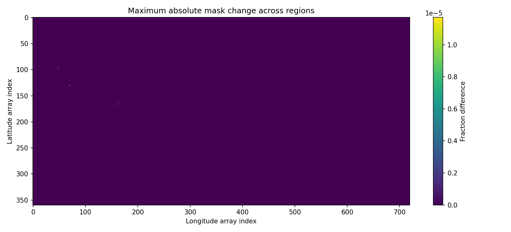

# Natural Earth regression report

Result: **FAIL**

Reference: `ad0760a3b3210aba51593a92bc5935f2b987feca`  
Repository HEAD (context only): `0b9cf5090aad745b4d7f98ecc311b1a154d1d70c`  
Repository worktree at start: **uncommitted changes present**  
Candidate: existing artifact directory; its producing code revision is not inferred.  
Runner: `compare existing artifacts`  
UTC start: `2026-09-09T14:03:43.328388+00:00`  
Elapsed: 161.9 seconds

Full input/output checksums, effective configuration, source hashes and installed package versions are in [manifest.json](manifest.json). All measurements are in [metrics.json](metrics.json).

## Acceptance policy

Shapefiles: attributes, IDs, CRS and geometry type must match; valid geometries must be spatially equal. Invalid geometries must be structurally equal after ordering normalization, without repair. Feature row order and equivalent vertex ordering are reported separately.

NetCDF: dimensions, coordinates, variable dtypes, attributes and missing-value patterns must match. Float comparison uses atol=0.0, rtol=0.0; coordinates and integer variables remain exact. Tolerances never suppress zero/one transition reporting.

File hashes and NetCDF compression/chunking are reported independently. Storage-only changes do not fail this semantic comparison; use --require-byte-identical for an exact-file gate.

Coverage diagnostics describe existing defects; PASS means reproduction of the reference, not certification of geographical correctness. The reference's historical environment and unsaved pre-normalization arrays are unknown.

## Configuration

```json
{
  "MASK_MIN_LON": "-0.25",
  "MASK_MIN_LAT": "-89.75",
  "MASK_MAX_LON": "359.75",
  "MASK_MAX_LAT": "90.25",
  "MASK_RESOLUTION": "0.5",
  "NORMALIZE_MASK": "true",
  "DASK_NUM_WORKERS": "4",
  "DASK_MEMORY_LIMIT": "2GB"
}
```

## Artifact comparisons

| Artifact | Semantic result | Byte identical |
|---|---|---|
| `data/countries_from_ne_10m/countries_from_ne_10m.shp` | PASS | False |
| `data/oceans_from_ne_10m/oceans_from_ne_10m.shp` | FAIL | False |
| `data/ne_10m_oceans_countries/ne_10m_oceans_countries.shp` | FAIL | False |
| `data/ne_10m_land_ocean/ne_10m_land_ocean.shp` | FAIL | False |
| `data/mask_ne_10m_oceans_countries_lat90.25_lon-0.25_res0.5.nc` | FAIL | False |
| `data/mask_ne_10m_land_ocean_lat90.25_lon-0.25_res0.5.nc` | FAIL | False |
| `data/ids_ne_10m_oceans_countries.csv` | PASS | True |
| `data/ids_ne_10m_land_ocean.csv` | PASS | True |

### `data/countries_from_ne_10m/countries_from_ne_10m.shp`

Area method: WGS84 surface-Jacobian integration over straight EPSG:4326 edges; signed fan triangles with 8/16-order quadrature error estimate plus roundoff. No seam wrapping, geometry repair, sliver deletion or geodesic reinterpretation. Uncertainty is numerical only, not a certified bound or source accuracy.

Feature row order equal: True. Added IDs: `[]`. Missing IDs: `[]`.

Numerical uncertainty below is an empirical integration/roundoff estimate, not source accuracy; no small features are suppressed.

| Region | Result | Reference km² | Candidate km² | Added km² | Removed km² | Net added−removed km² | Sym. difference km² | Numerical uncertainty km² | Changes |
|---|---|---:|---:|---:|---:|---:|---:|---:|---|
| AD | PASS | 452.239713 | 452.239713 | 0 | 0 | 0 | 0 | 0 |  |
| AE | PASS | 71084.9718 | 71084.9718 | 0 | 0 | 0 | 0 | 0 |  |
| AF | PASS | 642181.184 | 642181.184 | 0 | 0 | 0 | 0 | 0 |  |
| AG | PASS | 451.849631 | 451.849631 | 0 | 0 | 0 | 0 | 0 |  |
| AI | PASS | 87.4196732 | 87.4196732 | 0 | 0 | 0 | 0 | 0 |  |
| AK | PASS | 1505327.93 | 1505327.93 | 0 | 0 | 0 | 0 | 0 |  |
| AL | PASS | 28335.8092 | 28335.8092 | 0 | 0 | 0 | 0 | 0 |  |
| AM | PASS | 29588.2439 | 29588.2439 | 0 | 0 | 0 | 0 | 0 |  |
| AO | PASS | 1244652.27 | 1244652.27 | 0 | 0 | 0 | 0 | 0 |  |
| AQ | PASS | 12358217.8 | 12358217.8 | 0 | 0 | 0 | 0 | 0 |  |
| AR | PASS | 2782896.14 | 2782896.14 | 0 | 0 | 0 | 0 | 0 |  |
| AS | PASS | 180.304691 | 180.304691 | 0 | 0 | 0 | 0 | 0 |  |
| AT | PASS | 83993.2054 | 83993.2054 | 0 | 0 | 0 | 0 | 0 |  |
| AU | PASS | 7691173.77 | 7691173.77 | 0 | 0 | 0 | 0 | 0 |  |
| AW | PASS | 169.766336 | 169.766336 | 0 | 0 | 0 | 0 | 0 |  |
| AX | PASS | 942.062434 | 942.062434 | 0 | 0 | 0 | 0 | 0 |  |
| AZ | PASS | 86249.85 | 86249.85 | 0 | 0 | 0 | 0 | 0 |  |
| BA | PASS | 51826.6643 | 51826.6643 | 0 | 0 | 0 | 0 | 0 |  |
| BB | PASS | 444.222535 | 444.222535 | 0 | 0 | 0 | 0 | 0 |  |
| BD | PASS | 136903.703 | 136903.703 | 0 | 0 | 0 | 0 | 0 |  |
| BE | PASS | 30669.5823 | 30669.5823 | 0 | 0 | 0 | 0 | 0 |  |
| BF | PASS | 272768.895 | 272768.895 | 0 | 0 | 0 | 0 | 0 |  |
| BG | PASS | 112759.93 | 112759.93 | 0 | 0 | 0 | 0 | 0 |  |
| BH | PASS | 688.115758 | 688.115758 | 0 | 0 | 0 | 0 | 0 |  |
| BI | PASS | 27041.2346 | 27041.2346 | 0 | 0 | 0 | 0 | 0 |  |
| BJ | PASS | 116113.413 | 116113.413 | 0 | 0 | 0 | 0 | 0 |  |
| BJN | PASS | 0.0358638248 | 0.0358638248 | 0 | 0 | 0 | 0 | 0 |  |
| BL | PASS | 24.4219058 | 24.4219058 | 0 | 0 | 0 | 0 | 0 |  |
| BM | PASS | 62.3020282 | 62.3020282 | 0 | 0 | 0 | 0 | 0 |  |
| BN | PASS | 5716.64261 | 5716.64261 | 0 | 0 | 0 | 0 | 0 |  |
| BO | PASS | 1086808.21 | 1086808.21 | 0 | 0 | 0 | 0 | 0 |  |
| BR | PASS | 8472663.61 | 8472663.61 | 0 | 0 | 0 | 0 | 0 |  |
| BRI | PASS | 2.82461766 | 2.82461766 | 0 | 0 | 0 | 0 | 0 |  |
| BS | PASS | 12603.9118 | 12603.9118 | 0 | 0 | 0 | 0 | 0 |  |
| BT | PASS | 40421.3373 | 40421.3373 | 0 | 0 | 0 | 0 | 0 |  |
| BV | PASS | 55.2095212 | 55.2095212 | 0 | 0 | 0 | 0 | 0 |  |
| BW | PASS | 579029.331 | 579029.331 | 0 | 0 | 0 | 0 | 0 |  |
| BY | PASS | 207499.446 | 207499.446 | 0 | 0 | 0 | 0 | 0 |  |
| BZ | PASS | 22299.3917 | 22299.3917 | 0 | 0 | 0 | 0 | 0 |  |
| CA | PASS | 9945630.21 | 9945630.21 | 0 | 0 | 0 | 0 | 0 |  |
| CC | PASS | 13.2078827 | 13.2078827 | 0 | 0 | 0 | 0 | 0 |  |
| CD | PASS | 2325240.09 | 2325240.09 | 0 | 0 | 0 | 0 | 0 |  |
| CF | PASS | 617983.685 | 617983.685 | 0 | 0 | 0 | 0 | 0 |  |
| CG | PASS | 344888.667 | 344888.667 | 0 | 0 | 0 | 0 | 0 |  |
| CH | PASS | 41435.5398 | 41435.5398 | 0 | 0 | 0 | 0 | 0 |  |
| CI | PASS | 320677.295 | 320677.295 | 0 | 0 | 0 | 0 | 0 |  |
| CK | PASS | 191.132612 | 191.132612 | 0 | 0 | 0 | 0 | 0 |  |
| CL | PASS | 736594.71 | 736594.71 | 0 | 0 | 0 | 0 | 0 |  |
| CM | PASS | 464318.694 | 464318.694 | 0 | 0 | 0 | 0 | 0 |  |
| CN | PASS | 9375213.38 | 9375213.38 | 0 | 0 | 0 | 0 | 0 |  |
| CNM | PASS | 340.999133 | 340.999133 | 0 | 0 | 0 | 0 | 0 |  |
| CO | PASS | 1135117.72 | 1135117.72 | 0 | 0 | 0 | 0 | 0 |  |
| CP | PASS | 5.00195708 | 5.00195708 | 0 | 0 | 0 | 0 | 0 |  |
| CR | PASS | 51151.0857 | 51151.0857 | 0 | 0 | 0 | 0 | 0 |  |
| CU | PASS | 109929.29 | 109929.29 | 0 | 0 | 0 | 0 | 0 |  |
| CV | PASS | 3926.71493 | 3926.71493 | 0 | 0 | 0 | 0 | 0 |  |
| CW | PASS | 463.242864 | 463.242864 | 0 | 0 | 0 | 0 | 0 |  |
| CX | PASS | 98.7206547 | 98.7206547 | 0 | 0 | 0 | 0 | 0 |  |
| CY | PASS | 5395.03693 | 5395.03693 | 0 | 0 | 0 | 0 | 0 |  |
| CYN | PASS | 3319.41598 | 3319.41598 | 0 | 0 | 0 | 0 | 0 |  |
| CZ | PASS | 78758.9618 | 78758.9618 | 0 | 0 | 0 | 0 | 0 |  |
| DE | PASS | 357673.58 | 357673.58 | 0 | 0 | 0 | 0 | 0 |  |
| DJ | PASS | 21847.8468 | 21847.8468 | 0 | 0 | 0 | 0 | 0 |  |
| DK | PASS | 42696.0005 | 42696.0005 | 0 | 0 | 0 | 0 | 0 |  |
| DM | PASS | 730.311978 | 730.311978 | 0 | 0 | 0 | 0 | 0 |  |
| DO | PASS | 48439.8612 | 48439.8612 | 0 | 0 | 0 | 0 | 0 |  |
| DZ | PASS | 2308857.99 | 2308857.99 | 0 | 0 | 0 | 0 | 0 |  |
| EC | PASS | 255014.175 | 255014.175 | 0 | 0 | 0 | 0 | 0 |  |
| EE | PASS | 45818.9269 | 45818.9269 | 0 | 0 | 0 | 0 | 0 |  |
| EG | PASS | 1001058.5 | 1001058.5 | — | — | — | — | — | invalid reference: structural comparison |
| EH | PASS | 90495.6058 | 90495.6058 | 0 | 0 | 0 | 0 | 0 |  |
| EL | PASS | 131353.353 | 131353.353 | 0 | 0 | 0 | 0 | 0 |  |
| ER | PASS | 122537.866 | 122537.866 | 0 | 0 | 0 | 0 | 0 |  |
| ES | PASS | 506884.756 | 506884.756 | 0 | 0 | 0 | 0 | 0 |  |
| ET | PASS | 1127375.1 | 1127375.1 | 0 | 0 | 0 | 0 | 0 |  |
| EWSB | PASS | 226.10757 | 226.10757 | 0 | 0 | 0 | 0 | 0 |  |
| FI | PASS | 333059.254 | 333059.254 | 0 | 0 | 0 | 0 | 0 |  |
| FJ | PASS | 18930.0651 | 18930.0651 | 0 | 0 | 0 | 0 | 0 |  |
| FK | PASS | 11597.2466 | 11597.2466 | 0 | 0 | 0 | 0 | 0 |  |
| FM | PASS | 633.847668 | 633.847668 | 0 | 0 | 0 | 0 | 0 |  |
| FO | PASS | 1328.52582 | 1328.52582 | 0 | 0 | 0 | 0 | 0 |  |
| FR | PASS | 547841.262 | 547841.262 | 0 | 0 | 0 | 0 | 0 |  |
| GA | PASS | 259968.311 | 259968.311 | 0 | 0 | 0 | 0 | 0 |  |
| GD | PASS | 347.260195 | 347.260195 | 0 | 0 | 0 | 0 | 0 |  |
| GE | PASS | 69570.8009 | 69570.8009 | 0 | 0 | 0 | 0 | 0 |  |
| GF | PASS | 83183.7012 | 83183.7012 | 0 | 0 | 0 | 0 | 0 |  |
| GG | PASS | 73.9854901 | 73.9854901 | 0 | 0 | 0 | 0 | 0 |  |
| GH | PASS | 238668.652 | 238668.652 | 0 | 0 | 0 | 0 | 0 |  |
| GI | PASS | 3.69243611 | 3.69243611 | 0 | 0 | 0 | 0 | 0 |  |
| GL | PASS | 2154379.85 | 2154379.85 | 0 | 0 | 0 | 0 | 0 |  |
| GM | PASS | 10501.0802 | 10501.0802 | 0 | 0 | 0 | 0 | 0 |  |
| GN | PASS | 244302.086 | 244302.086 | 0 | 0 | 0 | 0 | 0 |  |
| GP | PASS | 1657.31913 | 1657.31913 | 0 | 0 | 0 | 0 | 0 |  |
| GQ | PASS | 26671.6543 | 26671.6543 | 0 | 0 | 0 | 0 | 0 |  |
| GS | PASS | 3921.50255 | 3921.50255 | 0 | 0 | 0 | 0 | 0 |  |
| GT | PASS | 108810.742 | 108810.742 | 0 | 0 | 0 | 0 | 0 |  |
| GU | PASS | 564.204331 | 564.204331 | 0 | 0 | 0 | 0 | 0 |  |
| GW | PASS | 32829.0709 | 32829.0709 | 0 | 0 | 0 | 0 | 0 |  |
| GY | PASS | 211213.631 | 211213.631 | 0 | 0 | 0 | 0 | 0 |  |
| HI | PASS | 16847.1687 | 16847.1687 | 0 | 0 | 0 | 0 | 0 |  |
| HK | PASS | 1036.20419 | 1036.20419 | 0 | 0 | 0 | 0 | 0 |  |
| HM | PASS | 394.836454 | 394.836454 | 0 | 0 | 0 | 0 | 0 |  |
| HN | PASS | 112236.487 | 112236.487 | 0 | 0 | 0 | 0 | 0 |  |
| HR | PASS | 55023.2204 | 55023.2204 | 0 | 0 | 0 | 0 | 0 |  |
| HT | PASS | 26891.5671 | 26891.5671 | 0 | 0 | 0 | 0 | 0 |  |
| HU | PASS | 93200.7241 | 93200.7241 | 0 | 0 | 0 | 0 | 0 |  |
| ID | PASS | 1879826.4 | 1879826.4 | 0 | 0 | 0 | 0 | 0 |  |
| IE | PASS | 69445.2259 | 69445.2259 | 0 | 0 | 0 | 0 | 0 |  |
| IL | PASS | 22101.3829 | 22101.3829 | 0 | 0 | 0 | 0 | 0 |  |
| IM | PASS | 574.811464 | 574.811464 | 0 | 0 | 0 | 0 | 0 |  |
| IN | PASS | 3150744.81 | 3150744.81 | 0 | 0 | 0 | 0 | 0 |  |
| IO | PASS | 49.0612331 | 49.0612331 | 0 | 0 | 0 | 0 | 0 |  |
| IQ | PASS | 437366.915 | 437366.915 | 0 | 0 | 0 | 0 | 0 |  |
| IR | PASS | 1622508.8 | 1622508.8 | 0 | 0 | 0 | 0 | 0 |  |
| IS | PASS | 102390.349 | 102390.349 | 0 | 0 | 0 | 0 | 0 |  |
| IT | PASS | 301184.608 | 301184.608 | 0 | 0 | 0 | 0 | 0 |  |
| JE | PASS | 119.049851 | 119.049851 | 0 | 0 | 0 | 0 | 0 |  |
| JM | PASS | 11032.9015 | 11032.9015 | 0 | 0 | 0 | 0 | 0 |  |
| JO | PASS | 88862.9176 | 88862.9176 | 0 | 0 | 0 | 0 | 0 |  |
| JP | PASS | 373507.156 | 373507.156 | 0 | 0 | 0 | 0 | 0 |  |
| KAB | PASS | 6501.49209 | 6501.49209 | 0 | 0 | 0 | 0 | 0 |  |
| KAS | PASS | 2087.5805 | 2087.5805 | 0 | 0 | 0 | 0 | 0 |  |
| KE | PASS | 585702.301 | 585702.301 | 0 | 0 | 0 | 0 | 0 |  |
| KG | PASS | 198990.031 | 198990.031 | 0 | 0 | 0 | 0 | 0 |  |
| KH | PASS | 181059.651 | 181059.651 | 0 | 0 | 0 | 0 | 0 |  |
| KI | PASS | 949.863122 | 949.863122 | 0 | 0 | 0 | 0 | 0 |  |
| KM | PASS | 1672.22638 | 1672.22638 | 0 | 0 | 0 | 0 | 0 |  |
| KN | PASS | 264.123571 | 264.123571 | 0 | 0 | 0 | 0 | 0 |  |
| KP | PASS | 122379.382 | 122379.382 | 0 | 0 | 0 | 0 | 0 |  |
| KR | PASS | 98544.061 | 98544.061 | 0 | 0 | 0 | 0 | 0 |  |
| KW | PASS | 17473.6837 | 17473.6837 | 0 | 0 | 0 | 0 | 0 |  |
| KY | PASS | 309.201606 | 309.201606 | 0 | 0 | 0 | 0 | 0 |  |
| KZ | PASS | 2714265.15 | 2714265.15 | 0 | 0 | 0 | 0 | 0 |  |
| LA | PASS | 228113.974 | 228113.974 | 0 | 0 | 0 | 0 | 0 |  |
| LB | PASS | 10004.0833 | 10004.0833 | 0 | 0 | 0 | 0 | 0 |  |
| LC | PASS | 605.132843 | 605.132843 | 0 | 0 | 0 | 0 | 0 |  |
| LI | PASS | 137.250378 | 137.250378 | 0 | 0 | 0 | 0 | 0 |  |
| LK | PASS | 66291.154 | 66291.154 | 0 | 0 | 0 | 0 | 0 |  |
| LR | PASS | 95298.2138 | 95298.2138 | 0 | 0 | 0 | 0 | 0 |  |
| LS | PASS | 30106.4589 | 30106.4589 | 0 | 0 | 0 | 0 | 0 |  |
| LT | PASS | 64938.8832 | 64938.8832 | 0 | 0 | 0 | 0 | 0 |  |
| LU | PASS | 2608.47636 | 2608.47636 | 0 | 0 | 0 | 0 | 0 |  |
| LV | PASS | 64576.3388 | 64576.3388 | 0 | 0 | 0 | 0 | 0 |  |
| LY | PASS | 1623758.9 | 1623758.9 | 0 | 0 | 0 | 0 | 0 |  |
| MA | PASS | 591743.606 | 591743.606 | 0 | 0 | 0 | 0 | 0 |  |
| MC | PASS | 18.8396291 | 18.8396291 | 0 | 0 | 0 | 0 | 0 |  |
| MD | PASS | 33206.5382 | 33206.5382 | 0 | 0 | 0 | 0 | 0 |  |
| ME | PASS | 13727.4776 | 13727.4776 | 0 | 0 | 0 | 0 | 0 |  |
| MF | PASS | 68.2813237 | 68.2813237 | 0 | 0 | 0 | 0 | 0 |  |
| MG | PASS | 592982.071 | 592982.071 | 0 | 0 | 0 | 0 | 0 |  |
| MH | PASS | 164.814684 | 164.814684 | 0 | 0 | 0 | 0 | 0 |  |
| MK | PASS | 25385.2205 | 25385.2205 | 0 | 0 | 0 | 0 | 0 |  |
| ML | PASS | 1252722.86 | 1252722.86 | 0 | 0 | 0 | 0 | 0 |  |
| MM | PASS | 663159.364 | 663159.364 | 0 | 0 | 0 | 0 | 0 |  |
| MN | PASS | 1564661.9 | 1564661.9 | 0 | 0 | 0 | 0 | 0 |  |
| MO | PASS | 30.0756495 | 30.0756495 | 0 | 0 | 0 | 0 | 0 |  |
| MP | PASS | 579.304548 | 579.304548 | 0 | 0 | 0 | 0 | 0 |  |
| MQ | PASS | 1097.45893 | 1097.45893 | 0 | 0 | 0 | 0 | 0 |  |
| MR | PASS | 1036389.27 | 1036389.27 | 0 | 0 | 0 | 0 | 0 |  |
| MS | PASS | 99.5973255 | 99.5973255 | 0 | 0 | 0 | 0 | 0 |  |
| MT | PASS | 325.684006 | 325.684006 | 0 | 0 | 0 | 0 | 0 |  |
| MU | PASS | 2014.43041 | 2014.43041 | 0 | 0 | 0 | 0 | 0 |  |
| MV | PASS | 108.742299 | 108.742299 | 0 | 0 | 0 | 0 | 0 |  |
| MW | PASS | 119397.758 | 119397.758 | 0 | 0 | 0 | 0 | 0 |  |
| MX | PASS | 1957844.96 | 1957844.96 | 0 | 0 | 0 | 0 | 0 |  |
| MY | PASS | 327884.702 | 327884.702 | 0 | 0 | 0 | 0 | 0 |  |
| MZ | PASS | 788447.27 | 788447.27 | 0 | 0 | 0 | 0 | 0 |  |
| NA | PASS | 822713.701 | 822713.701 | 0 | 0 | 0 | 0 | 0 |  |
| NC | PASS | 18841.0661 | 18841.0661 | 0 | 0 | 0 | 0 | 0 |  |
| NE | PASS | 1181302.4 | 1181302.4 | 0 | 0 | 0 | 0 | 0 |  |
| NF | PASS | 41.1466247 | 41.1466247 | 0 | 0 | 0 | 0 | 0 |  |
| NG | PASS | 907498.601 | 907498.601 | 0 | 0 | 0 | 0 | 0 |  |
| NI | PASS | 128684.688 | 128684.688 | 0 | 0 | 0 | 0 | 0 |  |
| NL | PASS | 37397.1247 | 37397.1247 | 0 | 0 | 0 | 0 | 0 |  |
| NO | PASS | 319477.014 | 319477.014 | 0 | 0 | 0 | 0 | 0 |  |
| NP | PASS | 147105.796 | 147105.796 | 0 | 0 | 0 | 0 | 0 |  |
| NR | PASS | 28.766922 | 28.766922 | 0 | 0 | 0 | 0 | 0 |  |
| NU | PASS | 220.573157 | 220.573157 | 0 | 0 | 0 | 0 | 0 |  |
| NZ | PASS | 268494.971 | 268494.971 | 0 | 0 | 0 | 0 | 0 |  |
| OM | PASS | 311213.146 | 311213.146 | 0 | 0 | 0 | 0 | 0 |  |
| PA | PASS | 74530.3226 | 74530.3226 | 0 | 0 | 0 | 0 | 0 |  |
| PE | PASS | 1289866.55 | 1289866.55 | 0 | 0 | 0 | 0 | 0 |  |
| PF | PASS | 3336.51523 | 3336.51523 | 0 | 0 | 0 | 0 | 0 |  |
| PG | PASS | 465147.248 | 465147.248 | 0 | 0 | 0 | 0 | 0 |  |
| PH | PASS | 293290.638 | 293290.638 | 0 | 0 | 0 | 0 | 0 |  |
| PK | PASS | 872939.239 | 872939.239 | 0 | 0 | 0 | 0 | 0 |  |
| PL | PASS | 313427.907 | 313427.907 | 0 | 0 | 0 | 0 | 0 |  |
| PM | PASS | 242.758757 | 242.758757 | 0 | 0 | 0 | 0 | 0 |  |
| PN | PASS | 42.569667 | 42.569667 | 0 | 0 | 0 | 0 | 0 |  |
| PR | PASS | 9005.95521 | 9005.95521 | 0 | 0 | 0 | 0 | 0 |  |
| PS | PASS | 6074.3692 | 6074.3692 | 0 | 0 | 0 | 0 | 0 |  |
| PT | PASS | 91390.4539 | 91390.4539 | 0 | 0 | 0 | 0 | 0 |  |
| PW | PASS | 491.931343 | 491.931343 | 0 | 0 | 0 | 0 | 0 |  |
| PY | PASS | 399901.367 | 399901.367 | 0 | 0 | 0 | 0 | 0 |  |
| QA | PASS | 11150.1304 | 11150.1304 | 0 | 0 | 0 | 0 | 0 |  |
| RE | PASS | 2582.42274 | 2582.42274 | 0 | 0 | 0 | 0 | 0 |  |
| RO | PASS | 236376.958 | 236376.958 | 0 | 0 | 0 | 0 | 0 |  |
| RS | PASS | 77628.6847 | 77628.6847 | 0 | 0 | 0 | 0 | 0 |  |
| RU | PASS | 16980191.7 | 16980191.7 | 0 | 0 | 0 | 0 | 0 |  |
| RW | PASS | 25305.0528 | 25305.0528 | 0 | 0 | 0 | 0 | 0 |  |
| SA | PASS | 1921724.96 | 1921724.96 | 0 | 0 | 0 | 0 | 0 |  |
| SB | PASS | 27198.8202 | 27198.8202 | 0 | 0 | 0 | 0 | 0 |  |
| SC | PASS | 435.664392 | 435.664392 | 0 | 0 | 0 | 0 | 0 |  |
| SD | PASS | 1855615.43 | 1855615.43 | 0 | 0 | 0 | 0 | 0 |  |
| SE | PASS | 446174.068 | 446174.068 | 0 | 0 | 0 | 0 | 0 |  |
| SER | PASS | 0.105288918 | 0.105288918 | 0 | 0 | 0 | 0 | 0 |  |
| SG | PASS | 510.502893 | 510.502893 | 0 | 0 | 0 | 0 | 0 |  |
| SH | PASS | 366.654705 | 366.654705 | 0 | 0 | 0 | 0 | 0 |  |
| SI | PASS | 20327.0056 | 20327.0056 | 0 | 0 | 0 | 0 | 0 |  |
| SJ | PASS | 62540.1664 | 62540.1664 | 0 | 0 | 0 | 0 | 0 |  |
| SK | PASS | 48457.9232 | 48457.9232 | 0 | 0 | 0 | 0 | 0 |  |
| SL | PASS | 71611.5656 | 71611.5656 | 0 | 0 | 0 | 0 | 0 |  |
| SLL | PASS | 167406.645 | 167406.645 | 0 | 0 | 0 | 0 | 0 |  |
| SM | PASS | 60.3172877 | 60.3172877 | 0 | 0 | 0 | 0 | 0 |  |
| SN | PASS | 196224.667 | 196224.667 | 0 | 0 | 0 | 0 | 0 |  |
| SO | PASS | 471815.311 | 471815.311 | 0 | 0 | 0 | 0 | 0 |  |
| SPI | PASS | 1408.91234 | 1408.91234 | 0 | 0 | 0 | 0 | 0 |  |
| SR | PASS | 145123.457 | 145123.457 | 0 | 0 | 0 | 0 | 0 |  |
| SS | PASS | 626859.419 | 626859.419 | 0 | 0 | 0 | 0 | 0 |  |
| ST | PASS | 1037.15612 | 1037.15612 | 0 | 0 | 0 | 0 | 0 |  |
| SV | PASS | 20539.4233 | 20539.4233 | 0 | 0 | 0 | 0 | 0 |  |
| SX | PASS | 23.3581607 | 23.3581607 | 0 | 0 | 0 | 0 | 0 |  |
| SY | PASS | 185939.225 | 185939.225 | 0 | 0 | 0 | 0 | 0 |  |
| SZ | PASS | 17111.8945 | 17111.8945 | 0 | 0 | 0 | 0 | 0 |  |
| TC | PASS | 445.214048 | 445.214048 | 0 | 0 | 0 | 0 | 0 |  |
| TD | PASS | 1266282.59 | 1266282.59 | 0 | 0 | 0 | 0 | 0 |  |
| TF | PASS | 7279.97132 | 7279.97132 | 0 | 0 | 0 | 0 | 0 |  |
| TG | PASS | 56863.3996 | 56863.3996 | 0 | 0 | 0 | 0 | 0 |  |
| TH | PASS | 514453.521 | 514453.521 | 0 | 0 | 0 | 0 | 0 |  |
| TJ | PASS | 142238.654 | 142238.654 | 0 | 0 | 0 | 0 | 0 |  |
| TK | PASS | 4.23496941 | 4.23496941 | 0 | 0 | 0 | 0 | 0 |  |
| TL | PASS | 15082.1704 | 15082.1704 | 0 | 0 | 0 | 0 | 0 |  |
| TM | PASS | 470849.518 | 470849.518 | 0 | 0 | 0 | 0 | 0 |  |
| TN | PASS | 156612.745 | 156612.745 | 0 | 0 | 0 | 0 | 0 |  |
| TO | PASS | 603.11016 | 603.11016 | 0 | 0 | 0 | 0 | 0 |  |
| TR | PASS | 780080.198 | 780080.198 | 0 | 0 | 0 | 0 | 0 |  |
| TT | PASS | 5122.91738 | 5122.91738 | 0 | 0 | 0 | 0 | 0 |  |
| TV | PASS | 23.0184169 | 23.0184169 | 0 | 0 | 0 | 0 | 0 |  |
| TW | PASS | 36197.8206 | 36197.8206 | 0 | 0 | 0 | 0 | 0 |  |
| TZ | PASS | 941505.504 | 941505.504 | 0 | 0 | 0 | 0 | 0 |  |
| UA | PASS | 571999.283 | 571999.283 | 0 | 0 | 0 | 0 | 0 |  |
| UG | PASS | 241853.52 | 241853.52 | 0 | 0 | 0 | 0 | 0 |  |
| UK | PASS | 243782.633 | 243782.633 | 0 | 0 | 0 | 0 | 0 |  |
| UM | PASS | 28.0045972 | 28.0045972 | 0 | 0 | 0 | 0 | 0 |  |
| US | PASS | 7942041.73 | 7942041.73 | 0 | 0 | 0 | 0 | 0 |  |
| USG | PASS | 65.3532346 | 65.3532346 | 0 | 0 | 0 | 0 | 0 |  |
| UY | PASS | 177342.176 | 177342.176 | 0 | 0 | 0 | 0 | 0 |  |
| UZ | PASS | 447831.24 | 447831.24 | 0 | 0 | 0 | 0 | 0 |  |
| VA | PASS | 0.0122038282 | 0.0122038282 | 0 | 0 | 0 | 0 | 0 |  |
| VC | PASS | 367.727551 | 367.727551 | 0 | 0 | 0 | 0 | 0 |  |
| VE | PASS | 912684.052 | 912684.052 | 0 | 0 | 0 | 0 | 0 |  |
| VG | PASS | 144.937585 | 144.937585 | 0 | 0 | 0 | 0 | 0 |  |
| VI | PASS | 354.792077 | 354.792077 | 0 | 0 | 0 | 0 | 0 |  |
| VN | PASS | 328891.98 | 328891.98 | 0 | 0 | 0 | 0 | 0 |  |
| VU | PASS | 12296.6293 | 12296.6293 | 0 | 0 | 0 | 0 | 0 |  |
| WF | PASS | 139.329721 | 139.329721 | 0 | 0 | 0 | 0 | 0 |  |
| WS | PASS | 2780.42177 | 2780.42177 | 0 | 0 | 0 | 0 | 0 |  |
| XA | PASS | 5.38788225 | 5.38788225 | 0 | 0 | 0 | 0 | 0 |  |
| XB | PASS | 11.980424 | 11.980424 | 0 | 0 | 0 | 0 | 0 |  |
| XK | PASS | 10913.1063 | 10913.1063 | 0 | 0 | 0 | 0 | 0 |  |
| XM | PASS | 0.0977859359 | 0.0977859359 | 0 | 0 | 0 | 0 | 0 |  |
| XV | PASS | 2019.40545 | 2019.40545 | 0 | 0 | 0 | 0 | 0 |  |
| YE | PASS | 453074.977 | 453074.977 | 0 | 0 | 0 | 0 | 0 |  |
| YT | PASS | 394.899696 | 394.899696 | 0 | 0 | 0 | 0 | 0 |  |
| ZA | PASS | 1219825.16 | 1219825.16 | 0 | 0 | 0 | 0 | 0 |  |
| ZM | PASS | 751914.442 | 751914.442 | 0 | 0 | 0 | 0 | 0 |  |
| ZW | PASS | 389338.121 | 389338.121 | 0 | 0 | 0 | 0 | 0 |  |

### `data/oceans_from_ne_10m/oceans_from_ne_10m.shp`

Area method: WGS84 surface-Jacobian integration over straight EPSG:4326 edges; signed fan triangles with 8/16-order quadrature error estimate plus roundoff. No seam wrapping, geometry repair, sliver deletion or geodesic reinterpretation. Uncertainty is numerical only, not a certified bound or source accuracy.

Feature row order equal: True. Added IDs: `[]`. Missing IDs: `[]`.

Numerical uncertainty below is an empirical integration/roundoff estimate, not source accuracy; no small features are suppressed.

| Region | Result | Reference km² | Candidate km² | Added km² | Removed km² | Net added−removed km² | Sym. difference km² | Numerical uncertainty km² | Changes |
|---|---|---:|---:|---:|---:|---:|---:|---:|---|
| OC_AO | FAIL | 15682752 | 15683215.3 | 463.351925 | 0.0109130495 | 463.341012 | 463.362838 | 1.75156454e-11 | geometry |
| OC_BS | FAIL | 420987.11 | 420987.107 | 3.12062852e-12 | 0.00331032211 | -0.0033103221 | 0.00331032211 | 1.69188503e-15 | geometry |
| OC_CS | FAIL | 396194.46 | 396194.46 | 1.34089695e-13 | 0.000115383557 | -0.000115383557 | 0.000115383557 | 5.60234157e-17 | geometry |
| OC_IO | FAIL | 71446682.7 | 71446666.1 | 6.53409264 | 23.1073899 | -16.5732973 | 29.6414826 | 5.03871237e-13 | geometry |
| OC_MR | FAIL | 2985332.52 | 2986379.61 | 1057.49125 | 10.3956822 | 1047.09557 | 1067.88693 | 1.83866909e-11 | geometry |
| OC_NAO | FAIL | 41661551 | 41660301.3 | 11.9401771 | 1261.67377 | -1249.73359 | 1273.61394 | 2.36131063e-11 | geometry |
| OC_NPO | FAIL | 76801095.4 | 76800892.4 | 76.4178741 | 279.386524 | -202.96865 | 355.804398 | 1.46600186e-11 | geometry |
| OC_SAO | FAIL | 40573062 | 40573060.5 | 0.975352999 | 2.55174778 | -1.57639478 | 3.52710078 | 5.27554929e-14 | geometry |
| OC_SCS | FAIL | 6828823.59 | 6828805.02 | 24.6494949 | 43.2189253 | -18.5694303 | 67.8684202 | 1.06916188e-12 | geometry |
| OC_SO | FAIL | 20873330.7 | 20873287.5 | 1.88447012e-11 | 43.2346948 | -43.2346948 | 43.2346948 | 6.74669795e-13 | geometry |
| OC_SPO | FAIL | 85554035.8 | 85554057.4 | 63.3256323 | 41.6899922 | 21.6356401 | 105.015625 | 4.53034576e-12 | geometry |

### `data/ne_10m_oceans_countries/ne_10m_oceans_countries.shp`

Area method: WGS84 surface-Jacobian integration over straight EPSG:4326 edges; signed fan triangles with 8/16-order quadrature error estimate plus roundoff. No seam wrapping, geometry repair, sliver deletion or geodesic reinterpretation. Uncertainty is numerical only, not a certified bound or source accuracy.

Feature row order equal: True. Added IDs: `[]`. Missing IDs: `[]`.

Numerical uncertainty below is an empirical integration/roundoff estimate, not source accuracy; no small features are suppressed.

| Region | Result | Reference km² | Candidate km² | Added km² | Removed km² | Net added−removed km² | Sym. difference km² | Numerical uncertainty km² | Changes |
|---|---|---:|---:|---:|---:|---:|---:|---:|---|
| AD | PASS | 452.239713 | 452.239713 | 0 | 0 | 0 | 0 | 0 |  |
| AE | PASS | 71084.9718 | 71084.9718 | 0 | 0 | 0 | 0 | 0 |  |
| AF | PASS | 642181.184 | 642181.184 | 0 | 0 | 0 | 0 | 0 |  |
| AG | PASS | 451.849631 | 451.849631 | 0 | 0 | 0 | 0 | 0 |  |
| AI | PASS | 87.4196732 | 87.4196732 | 0 | 0 | 0 | 0 | 0 |  |
| AK | PASS | 1505327.93 | 1505327.93 | 0 | 0 | 0 | 0 | 0 |  |
| AL | PASS | 28335.8092 | 28335.8092 | 0 | 0 | 0 | 0 | 0 |  |
| AM | PASS | 29588.2439 | 29588.2439 | 0 | 0 | 0 | 0 | 0 |  |
| AO | PASS | 1244652.27 | 1244652.27 | 0 | 0 | 0 | 0 | 0 |  |
| AQ | PASS | 12358217.8 | 12358217.8 | 0 | 0 | 0 | 0 | 0 |  |
| AR | PASS | 2782896.14 | 2782896.14 | 0 | 0 | 0 | 0 | 0 |  |
| AS | PASS | 180.304691 | 180.304691 | 0 | 0 | 0 | 0 | 0 |  |
| AT | PASS | 83993.2054 | 83993.2054 | 0 | 0 | 0 | 0 | 0 |  |
| AU | PASS | 7691173.77 | 7691173.77 | 0 | 0 | 0 | 0 | 0 |  |
| AW | PASS | 169.766336 | 169.766336 | 0 | 0 | 0 | 0 | 0 |  |
| AX | PASS | 942.062434 | 942.062434 | 0 | 0 | 0 | 0 | 0 |  |
| AZ | PASS | 86249.85 | 86249.85 | 0 | 0 | 0 | 0 | 0 |  |
| BA | PASS | 51826.6643 | 51826.6643 | 0 | 0 | 0 | 0 | 0 |  |
| BB | PASS | 444.222535 | 444.222535 | 0 | 0 | 0 | 0 | 0 |  |
| BD | PASS | 136903.703 | 136903.703 | 0 | 0 | 0 | 0 | 0 |  |
| BE | PASS | 30669.5823 | 30669.5823 | 0 | 0 | 0 | 0 | 0 |  |
| BF | PASS | 272768.895 | 272768.895 | 0 | 0 | 0 | 0 | 0 |  |
| BG | PASS | 112759.93 | 112759.93 | 0 | 0 | 0 | 0 | 0 |  |
| BH | PASS | 688.115758 | 688.115758 | 0 | 0 | 0 | 0 | 0 |  |
| BI | PASS | 27041.2346 | 27041.2346 | 0 | 0 | 0 | 0 | 0 |  |
| BJ | PASS | 116113.413 | 116113.413 | 0 | 0 | 0 | 0 | 0 |  |
| BJN | PASS | 0.0358638248 | 0.0358638248 | 0 | 0 | 0 | 0 | 0 |  |
| BL | PASS | 24.4219058 | 24.4219058 | 0 | 0 | 0 | 0 | 0 |  |
| BM | PASS | 62.3020282 | 62.3020282 | 0 | 0 | 0 | 0 | 0 |  |
| BN | PASS | 5716.64261 | 5716.64261 | 0 | 0 | 0 | 0 | 0 |  |
| BO | PASS | 1086808.21 | 1086808.21 | 0 | 0 | 0 | 0 | 0 |  |
| BR | PASS | 8472663.61 | 8472663.61 | 0 | 0 | 0 | 0 | 0 |  |
| BRI | PASS | 2.82461766 | 2.82461766 | 0 | 0 | 0 | 0 | 0 |  |
| BS | PASS | 12603.9118 | 12603.9118 | 0 | 0 | 0 | 0 | 0 |  |
| BT | PASS | 40421.3373 | 40421.3373 | 0 | 0 | 0 | 0 | 0 |  |
| BV | PASS | 55.2095212 | 55.2095212 | 0 | 0 | 0 | 0 | 0 |  |
| BW | PASS | 579029.331 | 579029.331 | 0 | 0 | 0 | 0 | 0 |  |
| BY | PASS | 207499.446 | 207499.446 | 0 | 0 | 0 | 0 | 0 |  |
| BZ | PASS | 22299.3917 | 22299.3917 | 0 | 0 | 0 | 0 | 0 |  |
| CA | PASS | 9945630.21 | 9945630.21 | 0 | 0 | 0 | 0 | 0 |  |
| CC | PASS | 13.2078827 | 13.2078827 | 0 | 0 | 0 | 0 | 0 |  |
| CD | PASS | 2325240.09 | 2325240.09 | 0 | 0 | 0 | 0 | 0 |  |
| CF | PASS | 617983.685 | 617983.685 | 0 | 0 | 0 | 0 | 0 |  |
| CG | PASS | 344888.667 | 344888.667 | 0 | 0 | 0 | 0 | 0 |  |
| CH | PASS | 41435.5398 | 41435.5398 | 0 | 0 | 0 | 0 | 0 |  |
| CI | PASS | 320677.295 | 320677.295 | 0 | 0 | 0 | 0 | 0 |  |
| CK | PASS | 191.132612 | 191.132612 | 0 | 0 | 0 | 0 | 0 |  |
| CL | PASS | 736594.71 | 736594.71 | 0 | 0 | 0 | 0 | 0 |  |
| CM | PASS | 464318.694 | 464318.694 | 0 | 0 | 0 | 0 | 0 |  |
| CN | PASS | 9375213.38 | 9375213.38 | 0 | 0 | 0 | 0 | 0 |  |
| CNM | PASS | 340.999133 | 340.999133 | 0 | 0 | 0 | 0 | 0 |  |
| CO | PASS | 1135117.72 | 1135117.72 | 0 | 0 | 0 | 0 | 0 |  |
| CP | PASS | 5.00195708 | 5.00195708 | 0 | 0 | 0 | 0 | 0 |  |
| CR | PASS | 51151.0857 | 51151.0857 | 0 | 0 | 0 | 0 | 0 |  |
| CU | PASS | 109929.29 | 109929.29 | 0 | 0 | 0 | 0 | 0 |  |
| CV | PASS | 3926.71493 | 3926.71493 | 0 | 0 | 0 | 0 | 0 |  |
| CW | PASS | 463.242864 | 463.242864 | 0 | 0 | 0 | 0 | 0 |  |
| CX | PASS | 98.7206547 | 98.7206547 | 0 | 0 | 0 | 0 | 0 |  |
| CY | PASS | 5395.03693 | 5395.03693 | 0 | 0 | 0 | 0 | 0 |  |
| CYN | PASS | 3319.41598 | 3319.41598 | 0 | 0 | 0 | 0 | 0 |  |
| CZ | PASS | 78758.9618 | 78758.9618 | 0 | 0 | 0 | 0 | 0 |  |
| DE | PASS | 357673.58 | 357673.58 | 0 | 0 | 0 | 0 | 0 |  |
| DJ | PASS | 21847.8468 | 21847.8468 | 0 | 0 | 0 | 0 | 0 |  |
| DK | PASS | 42696.0005 | 42696.0005 | 0 | 0 | 0 | 0 | 0 |  |
| DM | PASS | 730.311978 | 730.311978 | 0 | 0 | 0 | 0 | 0 |  |
| DO | PASS | 48439.8612 | 48439.8612 | 0 | 0 | 0 | 0 | 0 |  |
| DZ | PASS | 2308857.99 | 2308857.99 | 0 | 0 | 0 | 0 | 0 |  |
| EC | PASS | 255014.175 | 255014.175 | 0 | 0 | 0 | 0 | 0 |  |
| EE | PASS | 45818.9269 | 45818.9269 | 0 | 0 | 0 | 0 | 0 |  |
| EG | PASS | 1001058.5 | 1001058.5 | — | — | — | — | — | invalid reference: structural comparison |
| EH | PASS | 90495.6058 | 90495.6058 | 0 | 0 | 0 | 0 | 0 |  |
| EL | PASS | 131353.353 | 131353.353 | 0 | 0 | 0 | 0 | 0 |  |
| ER | PASS | 122537.866 | 122537.866 | 0 | 0 | 0 | 0 | 0 |  |
| ES | PASS | 506884.756 | 506884.756 | 0 | 0 | 0 | 0 | 0 |  |
| ET | PASS | 1127375.1 | 1127375.1 | 0 | 0 | 0 | 0 | 0 |  |
| EWSB | PASS | 226.10757 | 226.10757 | 0 | 0 | 0 | 0 | 0 |  |
| FI | PASS | 333059.254 | 333059.254 | 0 | 0 | 0 | 0 | 0 |  |
| FJ | PASS | 18930.0651 | 18930.0651 | 0 | 0 | 0 | 0 | 0 |  |
| FK | PASS | 11597.2466 | 11597.2466 | 0 | 0 | 0 | 0 | 0 |  |
| FM | PASS | 633.847668 | 633.847668 | 0 | 0 | 0 | 0 | 0 |  |
| FO | PASS | 1328.52582 | 1328.52582 | 0 | 0 | 0 | 0 | 0 |  |
| FR | PASS | 547841.262 | 547841.262 | 0 | 0 | 0 | 0 | 0 |  |
| GA | PASS | 259968.311 | 259968.311 | 0 | 0 | 0 | 0 | 0 |  |
| GD | PASS | 347.260195 | 347.260195 | 0 | 0 | 0 | 0 | 0 |  |
| GE | PASS | 69570.8009 | 69570.8009 | 0 | 0 | 0 | 0 | 0 |  |
| GF | PASS | 83183.7012 | 83183.7012 | 0 | 0 | 0 | 0 | 0 |  |
| GG | PASS | 73.9854901 | 73.9854901 | 0 | 0 | 0 | 0 | 0 |  |
| GH | PASS | 238668.652 | 238668.652 | 0 | 0 | 0 | 0 | 0 |  |
| GI | PASS | 3.69243611 | 3.69243611 | 0 | 0 | 0 | 0 | 0 |  |
| GL | PASS | 2154379.85 | 2154379.85 | 0 | 0 | 0 | 0 | 0 |  |
| GM | PASS | 10501.0802 | 10501.0802 | 0 | 0 | 0 | 0 | 0 |  |
| GN | PASS | 244302.086 | 244302.086 | 0 | 0 | 0 | 0 | 0 |  |
| GP | PASS | 1657.31913 | 1657.31913 | 0 | 0 | 0 | 0 | 0 |  |
| GQ | PASS | 26671.6543 | 26671.6543 | 0 | 0 | 0 | 0 | 0 |  |
| GS | PASS | 3921.50255 | 3921.50255 | 0 | 0 | 0 | 0 | 0 |  |
| GT | PASS | 108810.742 | 108810.742 | 0 | 0 | 0 | 0 | 0 |  |
| GU | PASS | 564.204331 | 564.204331 | 0 | 0 | 0 | 0 | 0 |  |
| GW | PASS | 32829.0709 | 32829.0709 | 0 | 0 | 0 | 0 | 0 |  |
| GY | PASS | 211213.631 | 211213.631 | 0 | 0 | 0 | 0 | 0 |  |
| HI | PASS | 16847.1687 | 16847.1687 | 0 | 0 | 0 | 0 | 0 |  |
| HK | PASS | 1036.20419 | 1036.20419 | 0 | 0 | 0 | 0 | 0 |  |
| HM | PASS | 394.836454 | 394.836454 | 0 | 0 | 0 | 0 | 0 |  |
| HN | PASS | 112236.487 | 112236.487 | 0 | 0 | 0 | 0 | 0 |  |
| HR | PASS | 55023.2204 | 55023.2204 | 0 | 0 | 0 | 0 | 0 |  |
| HT | PASS | 26891.5671 | 26891.5671 | 0 | 0 | 0 | 0 | 0 |  |
| HU | PASS | 93200.7241 | 93200.7241 | 0 | 0 | 0 | 0 | 0 |  |
| ID | PASS | 1879826.4 | 1879826.4 | 0 | 0 | 0 | 0 | 0 |  |
| IE | PASS | 69445.2259 | 69445.2259 | 0 | 0 | 0 | 0 | 0 |  |
| IL | PASS | 22101.3829 | 22101.3829 | 0 | 0 | 0 | 0 | 0 |  |
| IM | PASS | 574.811464 | 574.811464 | 0 | 0 | 0 | 0 | 0 |  |
| IN | PASS | 3150744.81 | 3150744.81 | 0 | 0 | 0 | 0 | 0 |  |
| IO | PASS | 49.0612331 | 49.0612331 | 0 | 0 | 0 | 0 | 0 |  |
| IQ | PASS | 437366.915 | 437366.915 | 0 | 0 | 0 | 0 | 0 |  |
| IR | PASS | 1622508.8 | 1622508.8 | 0 | 0 | 0 | 0 | 0 |  |
| IS | PASS | 102390.349 | 102390.349 | 0 | 0 | 0 | 0 | 0 |  |
| IT | PASS | 301184.608 | 301184.608 | 0 | 0 | 0 | 0 | 0 |  |
| JE | PASS | 119.049851 | 119.049851 | 0 | 0 | 0 | 0 | 0 |  |
| JM | PASS | 11032.9015 | 11032.9015 | 0 | 0 | 0 | 0 | 0 |  |
| JO | PASS | 88862.9176 | 88862.9176 | 0 | 0 | 0 | 0 | 0 |  |
| JP | PASS | 373507.156 | 373507.156 | 0 | 0 | 0 | 0 | 0 |  |
| KAB | PASS | 6501.49209 | 6501.49209 | 0 | 0 | 0 | 0 | 0 |  |
| KAS | PASS | 2087.5805 | 2087.5805 | 0 | 0 | 0 | 0 | 0 |  |
| KE | PASS | 585702.301 | 585702.301 | 0 | 0 | 0 | 0 | 0 |  |
| KG | PASS | 198990.031 | 198990.031 | 0 | 0 | 0 | 0 | 0 |  |
| KH | PASS | 181059.651 | 181059.651 | 0 | 0 | 0 | 0 | 0 |  |
| KI | PASS | 949.863122 | 949.863122 | 0 | 0 | 0 | 0 | 0 |  |
| KM | PASS | 1672.22638 | 1672.22638 | 0 | 0 | 0 | 0 | 0 |  |
| KN | PASS | 264.123571 | 264.123571 | 0 | 0 | 0 | 0 | 0 |  |
| KP | PASS | 122379.382 | 122379.382 | 0 | 0 | 0 | 0 | 0 |  |
| KR | PASS | 98544.061 | 98544.061 | 0 | 0 | 0 | 0 | 0 |  |
| KW | PASS | 17473.6837 | 17473.6837 | 0 | 0 | 0 | 0 | 0 |  |
| KY | PASS | 309.201606 | 309.201606 | 0 | 0 | 0 | 0 | 0 |  |
| KZ | PASS | 2714265.15 | 2714265.15 | 0 | 0 | 0 | 0 | 0 |  |
| LA | PASS | 228113.974 | 228113.974 | 0 | 0 | 0 | 0 | 0 |  |
| LB | PASS | 10004.0833 | 10004.0833 | 0 | 0 | 0 | 0 | 0 |  |
| LC | PASS | 605.132843 | 605.132843 | 0 | 0 | 0 | 0 | 0 |  |
| LI | PASS | 137.250378 | 137.250378 | 0 | 0 | 0 | 0 | 0 |  |
| LK | PASS | 66291.154 | 66291.154 | 0 | 0 | 0 | 0 | 0 |  |
| LR | PASS | 95298.2138 | 95298.2138 | 0 | 0 | 0 | 0 | 0 |  |
| LS | PASS | 30106.4589 | 30106.4589 | 0 | 0 | 0 | 0 | 0 |  |
| LT | PASS | 64938.8832 | 64938.8832 | 0 | 0 | 0 | 0 | 0 |  |
| LU | PASS | 2608.47636 | 2608.47636 | 0 | 0 | 0 | 0 | 0 |  |
| LV | PASS | 64576.3388 | 64576.3388 | 0 | 0 | 0 | 0 | 0 |  |
| LY | PASS | 1623758.9 | 1623758.9 | 0 | 0 | 0 | 0 | 0 |  |
| MA | PASS | 591743.606 | 591743.606 | 0 | 0 | 0 | 0 | 0 |  |
| MC | PASS | 18.8396291 | 18.8396291 | 0 | 0 | 0 | 0 | 0 |  |
| MD | PASS | 33206.5382 | 33206.5382 | 0 | 0 | 0 | 0 | 0 |  |
| ME | PASS | 13727.4776 | 13727.4776 | 0 | 0 | 0 | 0 | 0 |  |
| MF | PASS | 68.2813237 | 68.2813237 | 0 | 0 | 0 | 0 | 0 |  |
| MG | PASS | 592982.071 | 592982.071 | 0 | 0 | 0 | 0 | 0 |  |
| MH | PASS | 164.814684 | 164.814684 | 0 | 0 | 0 | 0 | 0 |  |
| MK | PASS | 25385.2205 | 25385.2205 | 0 | 0 | 0 | 0 | 0 |  |
| ML | PASS | 1252722.86 | 1252722.86 | 0 | 0 | 0 | 0 | 0 |  |
| MM | PASS | 663159.364 | 663159.364 | 0 | 0 | 0 | 0 | 0 |  |
| MN | PASS | 1564661.9 | 1564661.9 | 0 | 0 | 0 | 0 | 0 |  |
| MO | PASS | 30.0756495 | 30.0756495 | 0 | 0 | 0 | 0 | 0 |  |
| MP | PASS | 579.304548 | 579.304548 | 0 | 0 | 0 | 0 | 0 |  |
| MQ | PASS | 1097.45893 | 1097.45893 | 0 | 0 | 0 | 0 | 0 |  |
| MR | PASS | 1036389.27 | 1036389.27 | 0 | 0 | 0 | 0 | 0 |  |
| MS | PASS | 99.5973255 | 99.5973255 | 0 | 0 | 0 | 0 | 0 |  |
| MT | PASS | 325.684006 | 325.684006 | 0 | 0 | 0 | 0 | 0 |  |
| MU | PASS | 2014.43041 | 2014.43041 | 0 | 0 | 0 | 0 | 0 |  |
| MV | PASS | 108.742299 | 108.742299 | 0 | 0 | 0 | 0 | 0 |  |
| MW | PASS | 119397.758 | 119397.758 | 0 | 0 | 0 | 0 | 0 |  |
| MX | PASS | 1957844.96 | 1957844.96 | 0 | 0 | 0 | 0 | 0 |  |
| MY | PASS | 327884.702 | 327884.702 | 0 | 0 | 0 | 0 | 0 |  |
| MZ | PASS | 788447.27 | 788447.27 | 0 | 0 | 0 | 0 | 0 |  |
| NA | PASS | 822713.701 | 822713.701 | 0 | 0 | 0 | 0 | 0 |  |
| NC | PASS | 18841.0661 | 18841.0661 | 0 | 0 | 0 | 0 | 0 |  |
| NE | PASS | 1181302.4 | 1181302.4 | 0 | 0 | 0 | 0 | 0 |  |
| NF | PASS | 41.1466247 | 41.1466247 | 0 | 0 | 0 | 0 | 0 |  |
| NG | PASS | 907498.601 | 907498.601 | 0 | 0 | 0 | 0 | 0 |  |
| NI | PASS | 128684.688 | 128684.688 | 0 | 0 | 0 | 0 | 0 |  |
| NL | PASS | 37397.1247 | 37397.1247 | 0 | 0 | 0 | 0 | 0 |  |
| NO | PASS | 319477.014 | 319477.014 | 0 | 0 | 0 | 0 | 0 |  |
| NP | PASS | 147105.796 | 147105.796 | 0 | 0 | 0 | 0 | 0 |  |
| NR | PASS | 28.766922 | 28.766922 | 0 | 0 | 0 | 0 | 0 |  |
| NU | PASS | 220.573157 | 220.573157 | 0 | 0 | 0 | 0 | 0 |  |
| NZ | PASS | 268494.971 | 268494.971 | 0 | 0 | 0 | 0 | 0 |  |
| OC_AO | FAIL | 15682752 | 15683215.3 | 463.351925 | 0.0109130495 | 463.341012 | 463.362838 | 1.75156454e-11 | geometry |
| OC_BS | FAIL | 420987.11 | 420987.107 | 3.12062852e-12 | 0.00331032211 | -0.0033103221 | 0.00331032211 | 1.69188503e-15 | geometry |
| OC_CS | FAIL | 396194.46 | 396194.46 | 1.34089695e-13 | 0.000115383557 | -0.000115383557 | 0.000115383557 | 5.60234157e-17 | geometry |
| OC_IO | FAIL | 71446682.7 | 71446666.1 | 6.53409264 | 23.1073899 | -16.5732973 | 29.6414826 | 5.03871237e-13 | geometry |
| OC_MR | FAIL | 2985332.52 | 2986379.61 | 1057.49125 | 10.3956822 | 1047.09557 | 1067.88693 | 1.83866909e-11 | geometry |
| OC_NAO | FAIL | 41661551 | 41660301.3 | 11.9401771 | 1261.67377 | -1249.73359 | 1273.61394 | 2.36131063e-11 | geometry |
| OC_NPO | FAIL | 76801095.4 | 76800892.4 | 76.4178741 | 279.386524 | -202.96865 | 355.804398 | 1.46600186e-11 | geometry |
| OC_SAO | FAIL | 40573062 | 40573060.5 | 0.975352999 | 2.55174778 | -1.57639478 | 3.52710078 | 5.27554929e-14 | geometry |
| OC_SCS | FAIL | 6828823.59 | 6828805.02 | 24.6494949 | 43.2189253 | -18.5694303 | 67.8684202 | 1.06916188e-12 | geometry |
| OC_SO | FAIL | 20873330.7 | 20873287.5 | 1.88447012e-11 | 43.2346948 | -43.2346948 | 43.2346948 | 6.74669795e-13 | geometry |
| OC_SPO | FAIL | 85554035.8 | 85554057.4 | 63.3256323 | 41.6899922 | 21.6356401 | 105.015625 | 4.53034576e-12 | geometry |
| OM | PASS | 311213.146 | 311213.146 | 0 | 0 | 0 | 0 | 0 |  |
| PA | PASS | 74530.3226 | 74530.3226 | 0 | 0 | 0 | 0 | 0 |  |
| PE | PASS | 1289866.55 | 1289866.55 | 0 | 0 | 0 | 0 | 0 |  |
| PF | PASS | 3336.51523 | 3336.51523 | 0 | 0 | 0 | 0 | 0 |  |
| PG | PASS | 465147.248 | 465147.248 | 0 | 0 | 0 | 0 | 0 |  |
| PH | PASS | 293290.638 | 293290.638 | 0 | 0 | 0 | 0 | 0 |  |
| PK | PASS | 872939.239 | 872939.239 | 0 | 0 | 0 | 0 | 0 |  |
| PL | PASS | 313427.907 | 313427.907 | 0 | 0 | 0 | 0 | 0 |  |
| PM | PASS | 242.758757 | 242.758757 | 0 | 0 | 0 | 0 | 0 |  |
| PN | PASS | 42.569667 | 42.569667 | 0 | 0 | 0 | 0 | 0 |  |
| PR | PASS | 9005.95521 | 9005.95521 | 0 | 0 | 0 | 0 | 0 |  |
| PS | PASS | 6074.3692 | 6074.3692 | 0 | 0 | 0 | 0 | 0 |  |
| PT | PASS | 91390.4539 | 91390.4539 | 0 | 0 | 0 | 0 | 0 |  |
| PW | PASS | 491.931343 | 491.931343 | 0 | 0 | 0 | 0 | 0 |  |
| PY | PASS | 399901.367 | 399901.367 | 0 | 0 | 0 | 0 | 0 |  |
| QA | PASS | 11150.1304 | 11150.1304 | 0 | 0 | 0 | 0 | 0 |  |
| RE | PASS | 2582.42274 | 2582.42274 | 0 | 0 | 0 | 0 | 0 |  |
| RO | PASS | 236376.958 | 236376.958 | 0 | 0 | 0 | 0 | 0 |  |
| RS | PASS | 77628.6847 | 77628.6847 | 0 | 0 | 0 | 0 | 0 |  |
| RU | PASS | 16980191.7 | 16980191.7 | 0 | 0 | 0 | 0 | 0 |  |
| RW | PASS | 25305.0528 | 25305.0528 | 0 | 0 | 0 | 0 | 0 |  |
| SA | PASS | 1921724.96 | 1921724.96 | 0 | 0 | 0 | 0 | 0 |  |
| SB | PASS | 27198.8202 | 27198.8202 | 0 | 0 | 0 | 0 | 0 |  |
| SC | PASS | 435.664392 | 435.664392 | 0 | 0 | 0 | 0 | 0 |  |
| SD | PASS | 1855615.43 | 1855615.43 | 0 | 0 | 0 | 0 | 0 |  |
| SE | PASS | 446174.068 | 446174.068 | 0 | 0 | 0 | 0 | 0 |  |
| SER | PASS | 0.105288918 | 0.105288918 | 0 | 0 | 0 | 0 | 0 |  |
| SG | PASS | 510.502893 | 510.502893 | 0 | 0 | 0 | 0 | 0 |  |
| SH | PASS | 366.654705 | 366.654705 | 0 | 0 | 0 | 0 | 0 |  |
| SI | PASS | 20327.0056 | 20327.0056 | 0 | 0 | 0 | 0 | 0 |  |
| SJ | PASS | 62540.1664 | 62540.1664 | 0 | 0 | 0 | 0 | 0 |  |
| SK | PASS | 48457.9232 | 48457.9232 | 0 | 0 | 0 | 0 | 0 |  |
| SL | PASS | 71611.5656 | 71611.5656 | 0 | 0 | 0 | 0 | 0 |  |
| SLL | PASS | 167406.645 | 167406.645 | 0 | 0 | 0 | 0 | 0 |  |
| SM | PASS | 60.3172877 | 60.3172877 | 0 | 0 | 0 | 0 | 0 |  |
| SN | PASS | 196224.667 | 196224.667 | 0 | 0 | 0 | 0 | 0 |  |
| SO | PASS | 471815.311 | 471815.311 | 0 | 0 | 0 | 0 | 0 |  |
| SPI | PASS | 1408.91234 | 1408.91234 | 0 | 0 | 0 | 0 | 0 |  |
| SR | PASS | 145123.457 | 145123.457 | 0 | 0 | 0 | 0 | 0 |  |
| SS | PASS | 626859.419 | 626859.419 | 0 | 0 | 0 | 0 | 0 |  |
| ST | PASS | 1037.15612 | 1037.15612 | 0 | 0 | 0 | 0 | 0 |  |
| SV | PASS | 20539.4233 | 20539.4233 | 0 | 0 | 0 | 0 | 0 |  |
| SX | PASS | 23.3581607 | 23.3581607 | 0 | 0 | 0 | 0 | 0 |  |
| SY | PASS | 185939.225 | 185939.225 | 0 | 0 | 0 | 0 | 0 |  |
| SZ | PASS | 17111.8945 | 17111.8945 | 0 | 0 | 0 | 0 | 0 |  |
| TC | PASS | 445.214048 | 445.214048 | 0 | 0 | 0 | 0 | 0 |  |
| TD | PASS | 1266282.59 | 1266282.59 | 0 | 0 | 0 | 0 | 0 |  |
| TF | PASS | 7279.97132 | 7279.97132 | 0 | 0 | 0 | 0 | 0 |  |
| TG | PASS | 56863.3996 | 56863.3996 | 0 | 0 | 0 | 0 | 0 |  |
| TH | PASS | 514453.521 | 514453.521 | 0 | 0 | 0 | 0 | 0 |  |
| TJ | PASS | 142238.654 | 142238.654 | 0 | 0 | 0 | 0 | 0 |  |
| TK | PASS | 4.23496941 | 4.23496941 | 0 | 0 | 0 | 0 | 0 |  |
| TL | PASS | 15082.1704 | 15082.1704 | 0 | 0 | 0 | 0 | 0 |  |
| TM | PASS | 470849.518 | 470849.518 | 0 | 0 | 0 | 0 | 0 |  |
| TN | PASS | 156612.745 | 156612.745 | 0 | 0 | 0 | 0 | 0 |  |
| TO | PASS | 603.11016 | 603.11016 | 0 | 0 | 0 | 0 | 0 |  |
| TR | PASS | 780080.198 | 780080.198 | 0 | 0 | 0 | 0 | 0 |  |
| TT | PASS | 5122.91738 | 5122.91738 | 0 | 0 | 0 | 0 | 0 |  |
| TV | PASS | 23.0184169 | 23.0184169 | 0 | 0 | 0 | 0 | 0 |  |
| TW | PASS | 36197.8206 | 36197.8206 | 0 | 0 | 0 | 0 | 0 |  |
| TZ | PASS | 941505.504 | 941505.504 | 0 | 0 | 0 | 0 | 0 |  |
| UA | PASS | 571999.283 | 571999.283 | 0 | 0 | 0 | 0 | 0 |  |
| UG | PASS | 241853.52 | 241853.52 | 0 | 0 | 0 | 0 | 0 |  |
| UK | PASS | 243782.633 | 243782.633 | 0 | 0 | 0 | 0 | 0 |  |
| UM | PASS | 28.0045972 | 28.0045972 | 0 | 0 | 0 | 0 | 0 |  |
| US | PASS | 7942041.73 | 7942041.73 | 0 | 0 | 0 | 0 | 0 |  |
| USG | PASS | 65.3532346 | 65.3532346 | 0 | 0 | 0 | 0 | 0 |  |
| UY | PASS | 177342.176 | 177342.176 | 0 | 0 | 0 | 0 | 0 |  |
| UZ | PASS | 447831.24 | 447831.24 | 0 | 0 | 0 | 0 | 0 |  |
| VA | PASS | 0.0122038282 | 0.0122038282 | 0 | 0 | 0 | 0 | 0 |  |
| VC | PASS | 367.727551 | 367.727551 | 0 | 0 | 0 | 0 | 0 |  |
| VE | PASS | 912684.052 | 912684.052 | 0 | 0 | 0 | 0 | 0 |  |
| VG | PASS | 144.937585 | 144.937585 | 0 | 0 | 0 | 0 | 0 |  |
| VI | PASS | 354.792077 | 354.792077 | 0 | 0 | 0 | 0 | 0 |  |
| VN | PASS | 328891.98 | 328891.98 | 0 | 0 | 0 | 0 | 0 |  |
| VU | PASS | 12296.6293 | 12296.6293 | 0 | 0 | 0 | 0 | 0 |  |
| WF | PASS | 139.329721 | 139.329721 | 0 | 0 | 0 | 0 | 0 |  |
| WS | PASS | 2780.42177 | 2780.42177 | 0 | 0 | 0 | 0 | 0 |  |
| XA | PASS | 5.38788225 | 5.38788225 | 0 | 0 | 0 | 0 | 0 |  |
| XB | PASS | 11.980424 | 11.980424 | 0 | 0 | 0 | 0 | 0 |  |
| XK | PASS | 10913.1063 | 10913.1063 | 0 | 0 | 0 | 0 | 0 |  |
| XM | PASS | 0.0977859359 | 0.0977859359 | 0 | 0 | 0 | 0 | 0 |  |
| XV | PASS | 2019.40545 | 2019.40545 | 0 | 0 | 0 | 0 | 0 |  |
| YE | PASS | 453074.977 | 453074.977 | 0 | 0 | 0 | 0 | 0 |  |
| YT | PASS | 394.899696 | 394.899696 | 0 | 0 | 0 | 0 | 0 |  |
| ZA | PASS | 1219825.16 | 1219825.16 | 0 | 0 | 0 | 0 | 0 |  |
| ZM | PASS | 751914.442 | 751914.442 | 0 | 0 | 0 | 0 | 0 |  |
| ZW | PASS | 389338.121 | 389338.121 | 0 | 0 | 0 | 0 | 0 |  |

### `data/ne_10m_land_ocean/ne_10m_land_ocean.shp`

Area method: WGS84 surface-Jacobian integration over straight EPSG:4326 edges; signed fan triangles with 8/16-order quadrature error estimate plus roundoff. No seam wrapping, geometry repair, sliver deletion or geodesic reinterpretation. Uncertainty is numerical only, not a certified bound or source accuracy.

Feature row order equal: True. Added IDs: `[]`. Missing IDs: `[]`.

Numerical uncertainty below is an empirical integration/roundoff estimate, not source accuracy; no small features are suppressed.

| Region | Result | Reference km² | Candidate km² | Added km² | Removed km² | Net added−removed km² | Sym. difference km² | Numerical uncertainty km² | Changes |
|---|---|---:|---:|---:|---:|---:|---:|---:|---|
| L | PASS | 146826391 | 146826391 | 0 | 0 | 0 | 0 | 0 |  |
| OC | FAIL | 363223847 | 363223847 | 9.68834105e-13 | 0.587260981 | -0.587260981 | 0.587260981 | 1.77387108e-14 | geometry |

### `data/mask_ne_10m_oceans_countries_lat90.25_lon-0.25_res0.5.nc`

Schema/metadata changes: `[]`. Storage changes: `[]`.

| Variable | Exact values | Changed | Above tolerance | Missing pattern changes | Max absolute difference |
|---|---|---:|---:|---:|---:|
| lat | True | 0 | 0 | 0 | 0 |
| lon | True | 0 | 0 | 0 | 0 |
| mask | False | 515 | 515 | 0 | 0.293976247 |
| region | True | 0 | 0 | 0 | 0 |

Largest difference at `{'region': 'OC_NAO', 'lat': 36.0, 'lon': 354.0}`.

| Changed region | Changed values | Max absolute difference | Zero transitions | One transitions |
|---|---:|---:|---:|---:|
| ID | 3 | 1.49011612e-07 | 0 | 0 |
| AR | 1 | 1.49011612e-07 | 0 | 0 |
| IN | 4 | 1.07102096e-08 | 0 | 0 |
| CN | 3 | 1.31130219e-06 | 0 | 0 |
| IL | 1 | 5.96046448e-08 | 0 | 0 |
| PS | 1 | 7.4505806e-09 | 0 | 0 |
| SO | 2 | 9.95397568e-06 | 0 | 0 |
| OM | 3 | 1.1920929e-07 | 0 | 0 |
| KZ | 1 | 5.96046448e-08 | 0 | 0 |
| UY | 1 | 8.34465027e-07 | 0 | 0 |
| RU | 5 | 6.91413879e-06 | 0 | 0 |
| DE | 1 | 4.47034836e-07 | 0 | 0 |
| NO | 1 | 6.55651093e-07 | 0 | 0 |
| SE | 1 | 2.38418579e-07 | 0 | 0 |
| AE | 4 | 2.8014183e-06 | 0 | 0 |
| BE | 1 | 3.7252903e-08 | 0 | 0 |
| DK | 1 | 7.00354576e-07 | 0 | 0 |
| TN | 1 | 1.49011612e-08 | 0 | 0 |
| UK | 1 | 1.1920929e-07 | 0 | 0 |
| EL | 3 | 6.97374344e-06 | 0 | 0 |
| LR | 1 | 2.98023224e-08 | 0 | 0 |
| SD | 1 | 4.76837158e-07 | 0 | 0 |
| ER | 3 | 3.65078449e-07 | 0 | 0 |
| IQ | 1 | 8.04662704e-07 | 0 | 0 |
| IR | 2 | 1.1920929e-07 | 0 | 0 |
| NL | 1 | 1.78813934e-07 | 0 | 0 |
| CI | 1 | 5.96046448e-08 | 0 | 0 |
| SA | 2 | 1.93715096e-07 | 0 | 0 |
| PK | 2 | 5.36441803e-07 | 0 | 0 |
| KW | 1 | 7.4505806e-07 | 0 | 0 |
| GT | 1 | 5.54323196e-06 | 0 | 0 |
| TL | 1 | 8.94069672e-08 | 0 | 0 |
| DZ | 1 | 2.98023224e-08 | 0 | 0 |
| US | 4 | 1.96695328e-06 | 0 | 0 |
| CA | 2 | 2.68220901e-07 | 0 | 0 |
| MX | 1 | 4.24683094e-07 | 0 | 0 |
| PA | 1 | 3.21865082e-06 | 0 | 0 |
| EG | 2 | 1.17123127e-05 | 0 | 0 |
| YE | 2 | 3.7252903e-08 | 0 | 0 |
| HK | 1 | 1.49011612e-07 | 0 | 0 |
| AQ | 6 | 4.20212746e-06 | 0 | 0 |
| FJ | 1 | 1.02445483e-07 | 0 | 0 |
| PH | 1 | 5.96046448e-08 | 0 | 0 |
| LK | 18 | 6.19888306e-06 | 0 | 0 |
| MV | 25 | 9.31322575e-09 | 0 | 0 |
| BH | 1 | 2.08616257e-07 | 0 | 0 |
| MO | 1 | 3.7252903e-09 | 0 | 0 |
| GP | 1 | 6.2584877e-07 | 0 | 0 |
| OC_AO | 14 | 0.0987163484 | 1 | 0 |
| OC_BS | 3 | 8.34465027e-07 | 0 | 0 |
| OC_CS | 1 | 4.09781933e-08 | 0 | 0 |
| OC_IO | 49 | 0.00600511488 | 0 | 0 |
| OC_MR | 10 | 0.293976225 | 1 | 0 |
| OC_NAO | 18 | 0.293976247 | 2 | 0 |
| OC_NPO | 54 | 0.0611411277 | 33 | 0 |
| OC_SCS | 18 | 0.00600510836 | 0 | 0 |
| OC_SPO | 126 | 0.0120842233 | 0 | 114 |
| OC_SAO | 4 | 0.000637829304 | 0 | 0 |
| OC_SO | 94 | 0.000637799501 | 87 | 0 |


### `data/mask_ne_10m_land_ocean_lat90.25_lon-0.25_res0.5.nc`

Schema/metadata changes: `[]`. Storage changes: `[]`.

| Variable | Exact values | Changed | Above tolerance | Missing pattern changes | Max absolute difference |
|---|---|---:|---:|---:|---:|
| lat | True | 0 | 0 | 0 | 0 |
| lon | True | 0 | 0 | 0 | 0 |
| mask | False | 193 | 193 | 0 | 1.17123127e-05 |
| region | True | 0 | 0 | 0 | 0 |

Largest difference at `{'region': 'L', 'lat': 25.0, 'lon': 35.0}`.

| Changed region | Changed values | Max absolute difference | Zero transitions | One transitions |
|---|---:|---:|---:|---:|
| L | 104 | 1.17123127e-05 | 0 | 0 |
| OC | 89 | 1.16825104e-05 | 0 | 0 |



### `data/ids_ne_10m_oceans_countries.csv`

### `data/ids_ne_10m_land_ocean.csv`

## Coverage diagnostics

Union/gap/overlap diagnostics use explicitly repaired copies when necessary. The strict per-feature comparisons above never repair geometry.

| Product | Version | Uncovered world km² | Overlap footprint km² | Invalid IDs |
|---|---|---:|---:|---|

## Auxiliary raw masks

Pre-normalization arrays from generation runs are retained under `candidate/diagnostics/`. They have no historical baseline unless the supplied reference directory contains matching diagnostics. They are additional evidence, not replacements for the published NetCDF comparison.

### `raw_mask_ne_10m_land_ocean_lat90.25_lon-0.25_res0.5.nc`

No historical reference. Candidate diagnostics:

```json
{
  "cells_with_missing_or_infinite_regions": 0,
  "minimum": 0.5,
  "maximum": 1.0000000298023224,
  "cells_below_1_minus_1e_6": 2080,
  "cells_above_1_plus_1e_6": 0
}
```

### `raw_mask_ne_10m_oceans_countries_lat90.25_lon-0.25_res0.5.nc`

No historical reference. Candidate diagnostics:

```json
{
  "cells_with_missing_or_infinite_regions": 0,
  "minimum": 0.5,
  "maximum": 1.0007062958320603,
  "cells_below_1_minus_1e_6": 2082,
  "cells_above_1_plus_1e_6": 1
}
```

