# Controlled ocean correction review

Reference: `ad0760a3b3210aba51593a92bc5935f2b987feca`.

Production data and baseline are unchanged. This is a review experiment, not approval of any boundary.

## Measurement

WGS84 surface-Jacobian integration over straight EPSG:4326 edges; signed fan triangles with 8/16-order quadrature error estimate plus roundoff. No seam wrapping, geometry repair, sliver deletion or geodesic reinterpretation. Uncertainty is numerical only, not a certified bound or source accuracy.

Net is added minus removed; changed is added plus removed. A transfer appears in both affected regions. Uncertainty does not include input-coordinate or geographical uncertainty. Exact geometry acceptance remains unchanged.

## Total versus pinned baseline

| Region | Added km² | Removed km² | Net km² | Changed km² | Numerical uncertainty km² |
|---|---:|---:|---:|---:|---:|
| Arctic Ocean | 463.351925 | 0.0109130495 | 463.341012 | 463.362838 | 1.75156454e-11 |
| Baltic Sea | 3.12062852e-12 | 0.00331032211 | -0.0033103221 | 0.00331032211 | 1.69188503e-15 |
| Caspian Sea | 1.34089695e-13 | 0.000115383557 | -0.000115383557 | 0.000115383557 | 5.60234157e-17 |
| Indian Ocean | 6.53409264 | 23.1073899 | -16.5732973 | 29.6414826 | 5.03871237e-13 |
| Mediterranean Region | 1057.49125 | 10.3956822 | 1047.09557 | 1067.88693 | 1.83866909e-11 |
| North Atlantic Ocean | 11.9401771 | 1261.67377 | -1249.73359 | 1273.61394 | 2.36131063e-11 |
| North Pacific Ocean | 76.4178741 | 279.386524 | -202.96865 | 355.804398 | 1.46600186e-11 |
| South China and Easter Archipelagic Seas | 24.6494949 | 43.2189253 | -18.5694303 | 67.8684202 | 1.06916188e-12 |
| South Pacific Ocean | 63.3256323 | 41.6899922 | 21.6356401 | 105.015625 | 4.53034576e-12 |
| Southern Atlantic Ocean | 0.975352999 | 2.55174778 | -1.57639478 | 3.52710078 | 5.27554929e-14 |
| Southern Ocean | 1.88447012e-11 | 43.2346948 | -43.2346948 | 43.2346948 | 6.74669795e-13 |

## Controlled sequence

Each table compares to the preceding stage, not directly to baseline. Effects depend on order and interact. Legacy rerun is a control for runtime/implementation differences. Explicit repair measures repair-policy differences beyond repairs already implicit in the historical overlay. Country clipping may also change nearest-first assignments through gap connectivity. Gap inference includes deterministic grouping and replacement of the old nearest-first policy. The last stage isolates Gibraltar including its interaction with gap inference.

### 01_legacy_rerun

| Region | Added km² | Removed km² | Net km² | Changed km² | Numerical uncertainty km² |
|---|---:|---:|---:|---:|---:|
| Arctic Ocean | 0 | 0 | 0 | 0 | 0 |
| Baltic Sea | 0 | 0 | 0 | 0 | 0 |
| Caspian Sea | 0 | 0 | 0 | 0 | 0 |
| Indian Ocean | 0 | 0 | 0 | 0 | 0 |
| Mediterranean Region | 0 | 0 | 0 | 0 | 0 |
| North Atlantic Ocean | 0 | 0 | 0 | 0 | 0 |
| North Pacific Ocean | 0 | 0 | 0 | 0 | 0 |
| South China and Easter Archipelagic Seas | 0 | 0 | 0 | 0 | 0 |
| South Pacific Ocean | 0 | 0 | 0 | 0 | 0 |
| Southern Atlantic Ocean | 0 | 0 | 0 | 0 | 0 |
| Southern Ocean | 0 | 0 | 0 | 0 | 0 |

### 02_explicit_water_repair

| Region | Added km² | Removed km² | Net km² | Changed km² | Numerical uncertainty km² |
|---|---:|---:|---:|---:|---:|
| Arctic Ocean | 0 | 0 | 0 | 0 | 0 |
| Baltic Sea | 0 | 0 | 0 | 0 | 0 |
| Caspian Sea | 0 | 0 | 0 | 0 | 0 |
| Indian Ocean | 0 | 0 | 0 | 0 | 0 |
| Mediterranean Region | 0 | 0 | 0 | 0 | 0 |
| North Atlantic Ocean | 0 | 0 | 0 | 0 | 0 |
| North Pacific Ocean | 0 | 0 | 0 | 0 | 0 |
| South China and Easter Archipelagic Seas | 0 | 0 | 0 | 0 | 0 |
| South Pacific Ocean | 0 | 0 | 0 | 0 | 0 |
| Southern Atlantic Ocean | 0 | 0 | 0 | 0 | 0 |
| Southern Ocean | 0 | 0 | 0 | 0 | 0 |

### 03_country_clipping

| Region | Added km² | Removed km² | Net km² | Changed km² | Numerical uncertainty km² |
|---|---:|---:|---:|---:|---:|
| Arctic Ocean | 0 | 0.0109130494 | -0.0109130494 | 0.0109130494 | 9.89004842e-16 |
| Baltic Sea | 2.45216212e-14 | 0.0033103221 | -0.0033103221 | 0.0033103221 | 1.13276343e-16 |
| Caspian Sea | 0 | 0.000115383557 | -0.000115383557 | 0.000115383557 | 4.67877056e-17 |
| Indian Ocean | 9.326908e-13 | 0.391989695 | -0.391989695 | 0.391989695 | 4.27053174e-14 |
| Mediterranean Region | 8.42218631e-16 | 0.0277953199 | -0.0277953199 | 0.0277953199 | 4.24836698e-15 |
| North Atlantic Ocean | 2.67016113e-16 | 0.0263170661 | -0.0263170661 | 0.0263170661 | 5.84365438e-15 |
| North Pacific Ocean | 4.49032245e-13 | 0.063852439 | -0.063852439 | 0.063852439 | 7.36539953e-15 |
| South China and Easter Archipelagic Seas | 0 | 0.0116796023 | -0.0116796023 | 0.0116796023 | 4.20048399e-16 |
| South Pacific Ocean | 0 | 0.0111764928 | -0.0111764928 | 0.0111764928 | 2.49528674e-16 |
| Southern Atlantic Ocean | 2.53770951e-12 | 0.00271660799 | -0.00271660798 | 0.00271660799 | 9.41628762e-16 |
| Southern Ocean | 0 | 0.0373950034 | -0.0373950034 | 0.0373950034 | 4.32579024e-15 |

### 04_coarse_seam

| Region | Added km² | Removed km² | Net km² | Changed km² | Numerical uncertainty km² |
|---|---:|---:|---:|---:|---:|
| Arctic Ocean | 2.16013125e-12 | 0 | 2.16013125e-12 | 2.16013125e-12 | 6.23053211e-19 |
| Baltic Sea | 0 | 0 | 0 | 0 | 0 |
| Caspian Sea | 0 | 0 | 0 | 0 | 0 |
| Indian Ocean | 0 | 0 | 0 | 0 | 0 |
| Mediterranean Region | 0 | 0 | 0 | 0 | 0 |
| North Atlantic Ocean | 0 | 0 | 0 | 0 | 0 |
| North Pacific Ocean | 3.05156071e-14 | 20.1269446 | -20.1269446 | 20.1269446 | 2.89861584e-13 |
| South China and Easter Archipelagic Seas | 0 | 0 | 0 | 0 | 0 |
| South Pacific Ocean | 62.3488914 | 8.10640834e-13 | 62.3488914 | 62.3488914 | 3.90707545e-12 |
| Southern Atlantic Ocean | 0 | 0 | 0 | 0 | 0 |
| Southern Ocean | 3.88402515e-13 | 42.2219468 | -42.2219468 | 42.2219468 | 6.4902753e-13 |

### 05_gap_inference

| Region | Added km² | Removed km² | Net km² | Changed km² | Numerical uncertainty km² |
|---|---:|---:|---:|---:|---:|
| Arctic Ocean | 463.351925 | 8.51345627e-11 | 463.351925 | 463.351925 | 1.48006356e-11 |
| Baltic Sea | 0 | 1.52965135e-12 | -1.52965135e-12 | 1.52965135e-12 | 1.2571207e-16 |
| Caspian Sea | 1.34089695e-13 | 3.64766107e-13 | -2.30676413e-13 | 4.98855802e-13 | 9.23571019e-18 |
| Indian Ocean | 6.53409264 | 22.7154002 | -16.1813076 | 29.2494929 | 4.64353013e-13 |
| Mediterranean Region | 8.08209391e-12 | 25.5969043 | -25.5969043 | 25.5969043 | 4.39201081e-13 |
| North Atlantic Ocean | 27.1691946 | 204.156198 | -176.987004 | 231.325393 | 7.97350032e-12 |
| North Pacific Ocean | 76.4178741 | 259.195727 | -182.777853 | 335.613601 | 1.44231878e-11 |
| South China and Easter Archipelagic Seas | 24.6494949 | 43.2072457 | -18.5577507 | 67.8567406 | 1.07675902e-12 |
| South Pacific Ocean | 0.976740911 | 41.6788157 | -40.7020748 | 42.6555567 | 6.23020786e-13 |
| Southern Atlantic Ocean | 0.975352999 | 2.54903117 | -1.57367817 | 3.52438417 | 5.22588207e-14 |
| Southern Ocean | 1.84562987e-11 | 0.975353 | -0.975353 | 0.975353 | 2.17744426e-14 |

### 06_gibraltar

| Region | Added km² | Removed km² | Net km² | Changed km² | Numerical uncertainty km² |
|---|---:|---:|---:|---:|---:|
| Arctic Ocean | 0 | 0 | 0 | 0 | 0 |
| Baltic Sea | 0 | 0 | 0 | 0 | 0 |
| Caspian Sea | 0 | 0 | 0 | 0 | 0 |
| Indian Ocean | 0 | 0 | 0 | 0 | 0 |
| Mediterranean Region | 1072.8174 | 0.0971338774 | 1072.72027 | 1072.91454 | 1.9526872e-11 |
| North Atlantic Ocean | 0.0971338774 | 1072.8174 | -1072.72027 | 1072.91454 | 2.09162237e-11 |
| North Pacific Ocean | 0 | 0 | 0 | 0 | 0 |
| South China and Easter Archipelagic Seas | 0 | 0 | 0 | 0 | 0 |
| South Pacific Ocean | 0 | 0 | 0 | 0 | 0 |
| Southern Atlantic Ocean | 0 | 0 | 0 | 0 | 0 |
| Southern Ocean | 0 | 0 | 0 | 0 | 0 |

## Review atlas

Axes are longitude/latitude, not an equal-area map. Grey means outside the displayed polygons, not necessarily land. Magenta includes label transfers and footprint differences. Fine slivers can be smaller than a pixel. All locations remain unapproved; inspect source names as well as geometry.

### 00: Gibraltar

Bounds: `(-6.3, 35.6, -5.1, 36.4)`. Status: **unreviewed**.

Coarse source names: Alboran Sea, North Atlantic Ocean, Strait of Gibraltar.

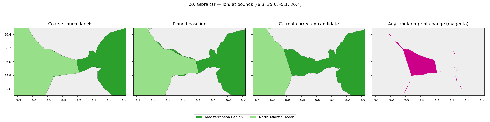

### 01: Ambiguous gap

Bounds: `[-127.71424028207686, 51.26145793740512, -127.11412512899994, 51.398504950000074]`. Status: **unreviewed**.

Coarse source names: Queen Charlotte Sound, Smith Sound.

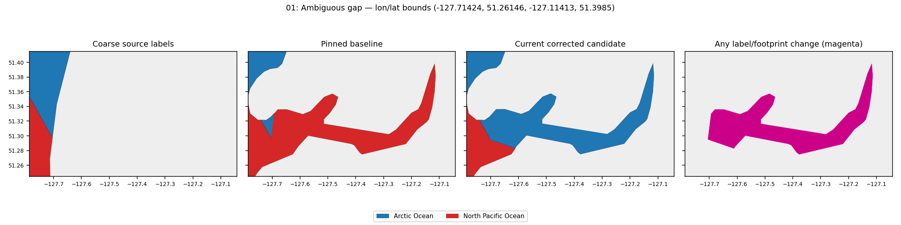

### 02: Ambiguous gap

Bounds: `[-128.3327257860352, 51.995033124607865, -127.84748287699989, 52.51512278900003]`. Status: **unreviewed**.

Coarse source names: Internal Canada (B.C.) Waters, Queen Charlotte Sound, Smith Sound.

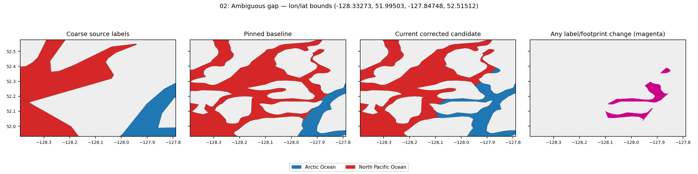

### 03: Ambiguous gap

Bounds: `[-80.365357918541, -0.2207703524151039, -80.03697669199994, 0.21609453774338247]`. Status: **unreviewed**.

Coarse source names: North Pacific Ocean, South Pacific Ocean.

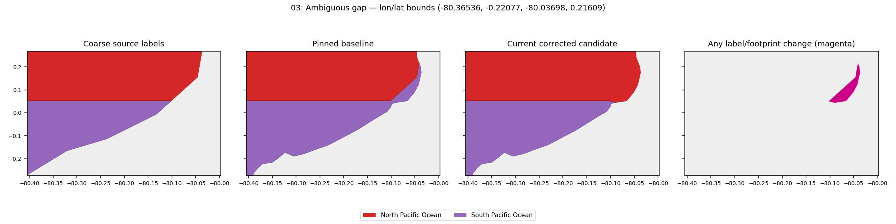

### 04: Ambiguous gap

Bounds: `[-68.73116164145947, -52.32418680331652, -68.63795322885056, -52.306908268999905]`. Status: **unreviewed**.

Coarse source names: Estrecho de Magellanes, South Atlantic Ocean.

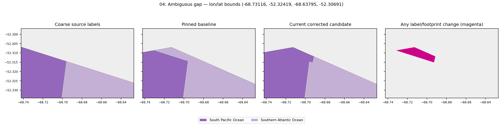

### 05: Ambiguous gap

Bounds: `[-64.8183630732002, 60.2884766898991, -64.45886317697205, 60.407474579670634]`. Status: **unreviewed**.

Coarse source names: Davis Strait, Hudson Strait, Labrador Sea.

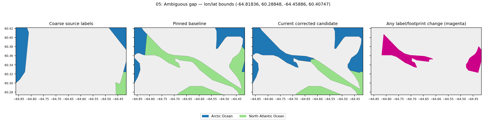

### 06: Ambiguous gap

Bounds: `[-64.47744706899994, 60.305241383892145, -64.40686418319078, 60.380782711778494]`. Status: **unreviewed**.

Coarse source names: Davis Strait, Labrador Sea.

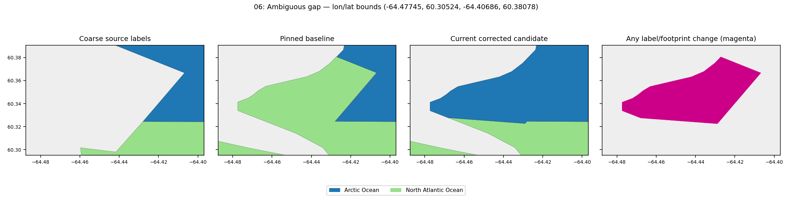

### 07: Ambiguous gap

Bounds: `[-45.65019576646769, -60.55486419099992, -45.49932174739949, -60.52878360956686]`. Status: **unreviewed**.

Coarse source names: SOUTHERN OCEAN, South Atlantic Ocean.

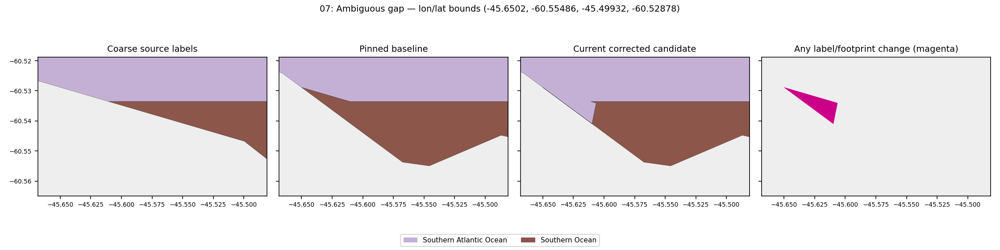

### 08: Ambiguous gap

Bounds: `[-51.35845751457723, -0.2993128415780334, -51.34623189935231, -0.27436715961233704]`. Status: **unreviewed**.

Coarse source names: Amazon River.

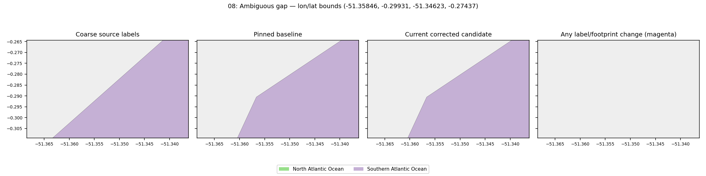

### 09: Ambiguous gap

Bounds: `[-51.333204291279024, -0.2477850562342201, -51.309277663484046, -0.19896411458785052]`. Status: **unreviewed**.

Coarse source names: Amazon River, Canal do Norte.

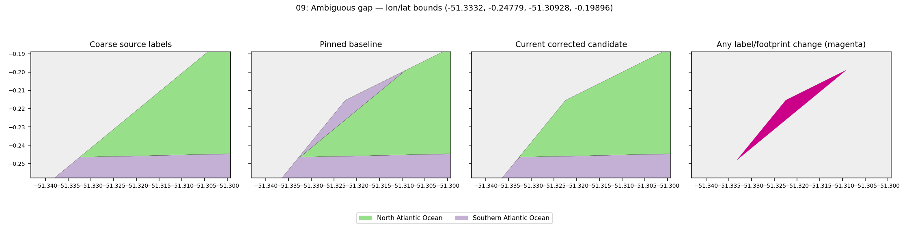

### 10: Ambiguous gap

Bounds: `[-45.35269070174951, 60.15421672610888, -44.84447180899991, 60.47797272300005]`. Status: **unreviewed**.

Coarse source names: Davis Strait, Labrador Sea.

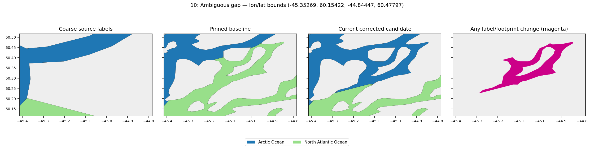

### 11: Ambiguous gap

Bounds: `[-28.507923956999946, 68.42341512291986, -28.397687623565222, 68.44757721600007]`. Status: **unreviewed**.

Coarse source names: Denmark Strait, Greenland Sea.

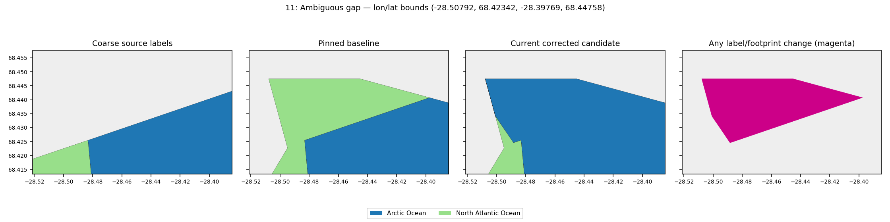

### 12: Ambiguous gap

Bounds: `[-1.1250707669999542, 60.373928127000056, -1.0555317944802447, 60.42926304227962]`. Status: **unreviewed**.

Coarse source names: North Sea, Norwegian Sea.

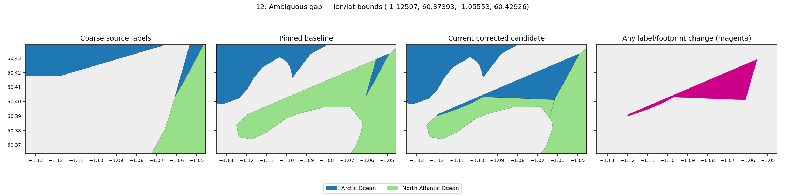

### 13: Ambiguous gap

Bounds: `[105.25090754428687, -6.767347914999959, 105.34584341756106, -6.671399816203819]`. Status: **unreviewed**.

Coarse source names: INDIAN OCEAN, Java Sea.

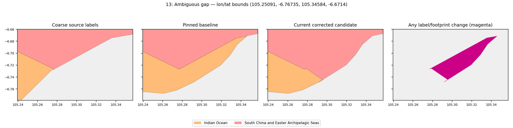

### 14: Ambiguous gap

Bounds: `[116.9223623474247, -9.082730678401111, 116.98776787570391, -9.060153903999947]`. Status: **unreviewed**.

Coarse source names: Bali Sea, INDIAN OCEAN.

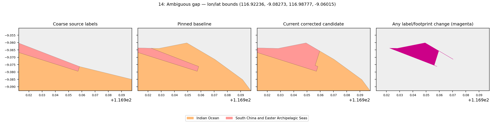

### 15: Ambiguous gap

Bounds: `[120.64970271929504, -10.224301364739416, 120.65493976209858, -10.22234954661923]`. Status: **unreviewed**.

Coarse source names: INDIAN OCEAN, Savu Sea.

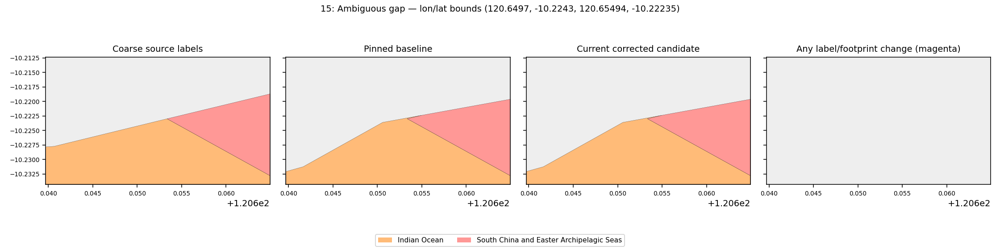

### 16: Ambiguous gap

Bounds: `[120.96321114493182, 13.716729876179151, 121.05347741000003, 13.783636786000045]`. Status: **unreviewed**.

Coarse source names: South China Sea, Tayabas Bay.

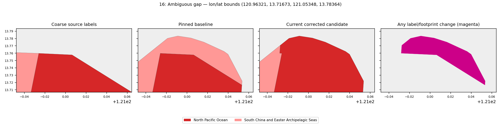

### 17: Ambiguous gap

Bounds: `[121.08051318491783, 25.056546996959817, 121.15092506928929, 25.08450778194485]`. Status: **unreviewed**.

Coarse source names: East China Sea, Taiwan Strait.

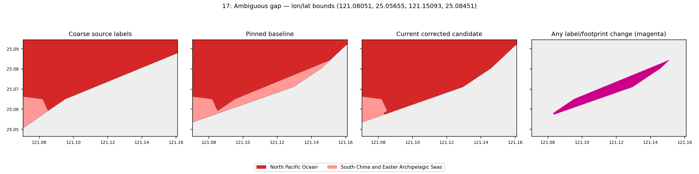

### 18: Ambiguous gap

Bounds: `[123.35596764400009, -10.59658329886272, 123.39907677357792, -10.541623616540322]`. Status: **unreviewed**.

Coarse source names: Savu Sea, Timor Sea.

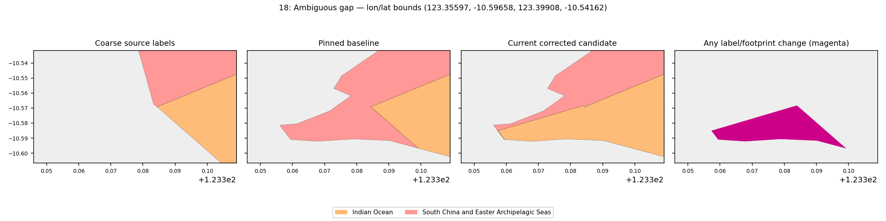

### 19: Ambiguous gap

Bounds: `[123.39271927332102, 8.629828192000048, 123.43637129000001, 8.676736624265965]`. Status: **unreviewed**.

Coarse source names: Bohol Sea, Sulu Sea.

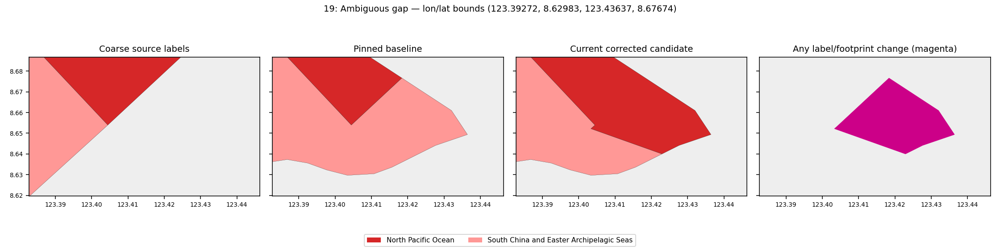

### 20: Ambiguous gap

Bounds: `[122.60925332351461, 10.754740514252042, 122.65139929634537, 10.78514685783854]`. Status: **unreviewed**.

Coarse source names: Sulu Sea, Visayan Sea.

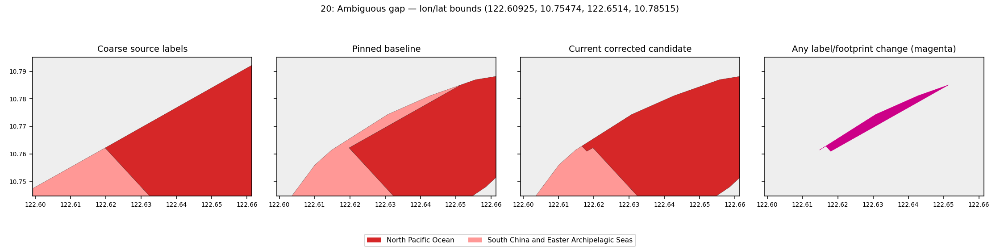

### 21: Ambiguous gap

Bounds: `[121.41229420418706, 12.410542418573483, 121.41430222778372, 12.422474023069718]`. Status: **unreviewed**.

Coarse source names: Sibuyan Sea.

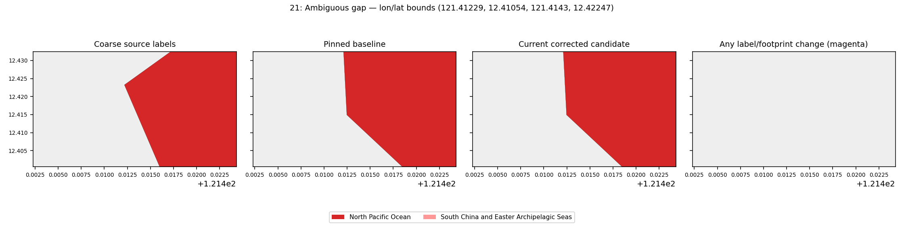

### 22: Ambiguous gap

Bounds: `[130.2992468341448, -0.10678476399993997, 130.33628987627796, -0.08400652549910564]`. Status: **unreviewed**.

Coarse source names: Selat Dampier.

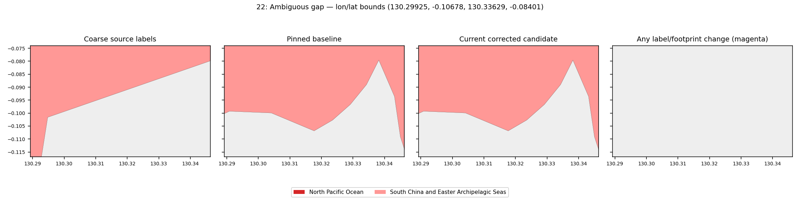

### 23: Ambiguous gap

Bounds: `[130.5397187548196, -0.07268645599992851, 130.5452328205108, -0.06815987916519445]`. Status: **unreviewed**.

Coarse source names: Selat Dampier.

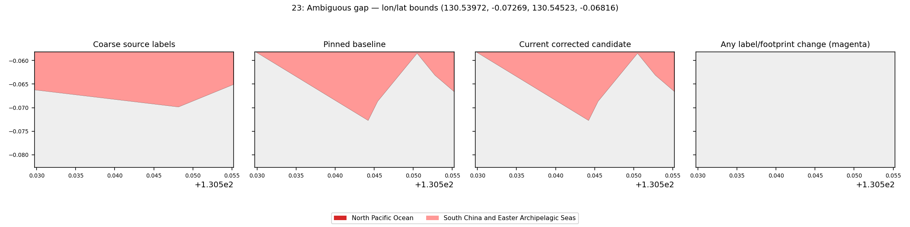

### 24: Ambiguous gap

Bounds: `[126.80384523312465, 4.026877144000987, 126.88591132516189, 4.23790866173767]`. Status: **unreviewed**.

Coarse source names: Molucca Sea, Philippine Sea.

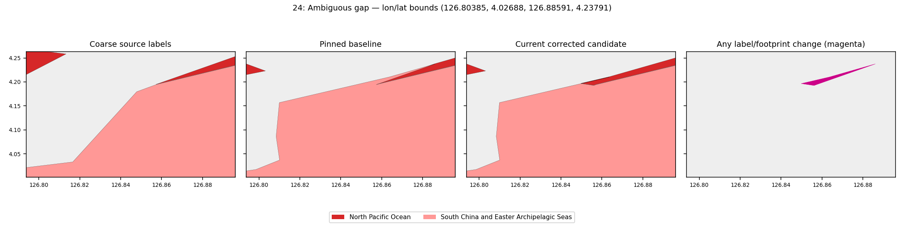

### 25: Ambiguous gap

Bounds: `[133.39665774800005, -3.8033716436629907, 133.49616564024896, -3.63211480392185]`. Status: **unreviewed**.

Coarse source names: Arafura Sea, Ceram Sea.

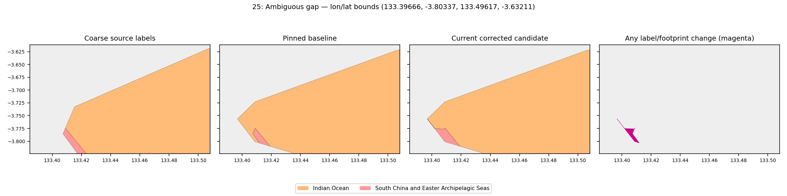

### 26: Ambiguous gap

Bounds: `[131.30697379532063, -0.3203762903290799, 131.33240297462766, -0.297224113301836]`. Status: **unreviewed**.

Coarse source names: Selat Dampier, South Pacific Ocean.

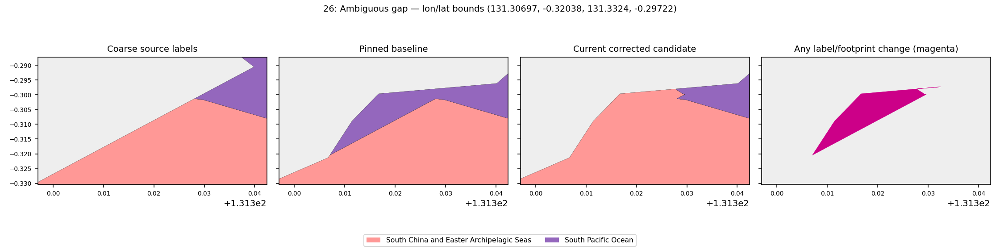

### 27: Ambiguous gap

Bounds: `[131.1738793775465, -0.14119310443312924, 131.25740384421545, -0.10467676498170625]`. Status: **unreviewed**.

Coarse source names: South Pacific Ocean.

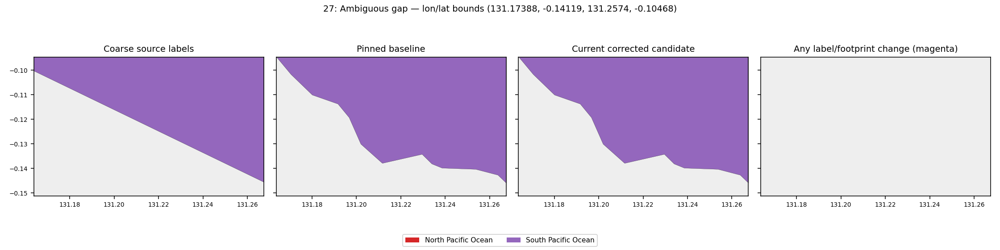

### 28: Ambiguous gap

Bounds: `[131.043793165, -0.07266685902977142, 131.10066255562725, -0.052617403738900684]`. Status: **unreviewed**.

Coarse source names: North Pacific Ocean, South Pacific Ocean.

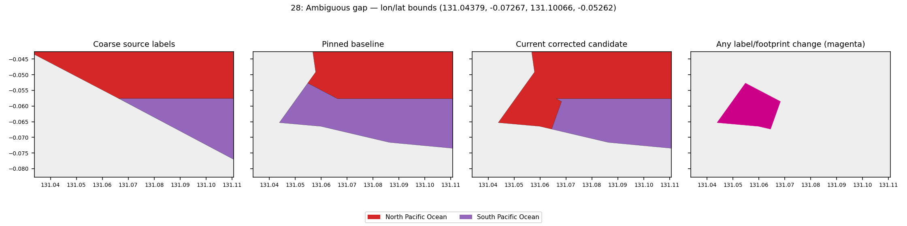

